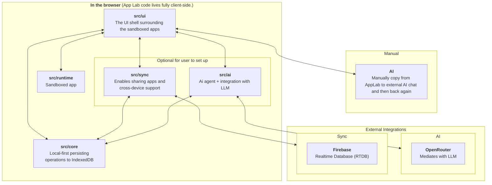

# App Lab

App Lab is a browser workspace for creating, editing, running, exporting, and syncing small sandboxed HTML apps. The host is a
React/Vite application; user apps are complete HTML documents that run inside isolated iframes and persist JSON data through the
host-provided `window.AppLab` API.

## How It Fits Together



App Lab itself is local-first: the workspace and each app's JSON data live in this browser first. The generated app cannot reach
the host, Firebase, or your settings directly; it only exchanges app-data messages with the sandbox runtime. Firebase sync and
AI assistance are opt-in integrations, not requirements for using the workspace.

The important architecture docs are:

- [Architecture overview](./docs/architecture.md)
- [General architecture](./docs/1.architecture-general.md)
- [Sync architecture](./docs/2.architecture-sync.md)
- [Deployment](./docs/deploy.md)
- [Backlog](./docs/backlog.md)

## Development

```bash
pnpm install
pnpm hooks:install
pnpm dev
pnpm typecheck
pnpm test
pnpm test:e2e
pnpm deps:check
pnpm check
```

The normal local loop is `pnpm typecheck`, `pnpm test`, and `pnpm test:e2e`. These commands do not require Firebase credentials;
`pnpm test:e2e` excludes tests tagged `@firebase`.

Run `pnpm hooks:install` once per clone to activate the tracked Git hooks. The pre-commit hook runs `pnpm check`, which checks the
module boundaries, unit tests, TypeScript, and the production build. Browser and real Firebase tests remain explicit because they
are slower and may require local credentials.

Real Firebase checks are opt-in and load `.env.test.local`; copy the shape from
[.env.test.local.example](./.env.test.local.example). With that file configured:

```bash
pnpm test:firebase-smoke
pnpm test:firebase-e2e
```

`pnpm test:firebase-smoke` verifies low-level provider and RTDB rules behavior. `pnpm test:firebase-e2e` runs the browser-level
sync workflows tagged `@firebase`.

`pnpm deps:graph` writes a compact folder-level Mermaid import graph to `dependency-graph.mmd`;
`pnpm deps:graph:files` writes the detailed per-file graph. Both generated files are ignored by Git.

Each top-level source module exposes its production API through `src/<module>/index.ts`. Code outside that module must use this
entry point instead of importing implementation files directly; `pnpm deps:check` enforces the boundary. Tests may import module
internals when focused coverage requires it.
