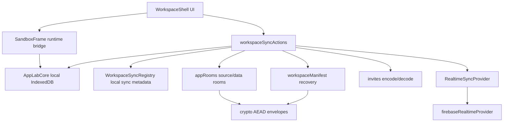
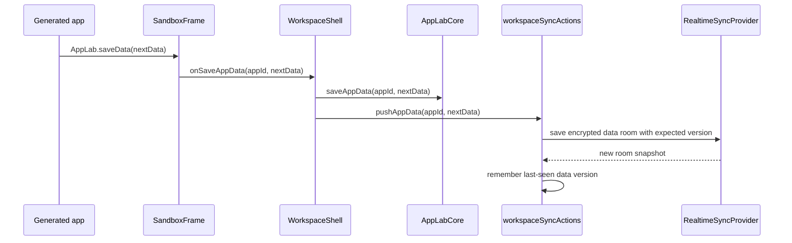
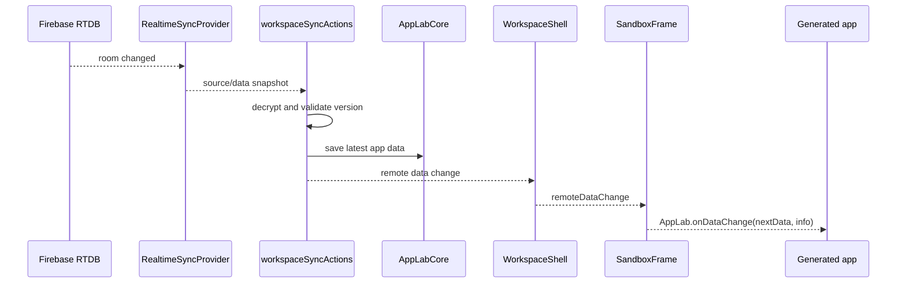

# App Lab Sync Architecture

This document describes the current sync architecture: what each layer owns, which modules talk to each other, and which behavior
is intentionally still limited.

Sync is built around one rule: generated apps do not know about Firebase, rooms, encryption, invites, or workspace manifests.
Generated apps only use the App Lab runtime API. The host shell and sync modules translate local app actions into encrypted remote
room updates.

## Current Shape

```text
React shell / settings / launcher
  |
  | calls app-level sync operations
  v
workspaceSyncActions facade
  |
  | coordinates local core, sync registry, rooms, invites, manifest, providers
  v
sync domain modules
  |
  | encrypt/decrypt and version-check source/data/manifest rooms
  v
RealtimeSyncProvider interface
  |
  | adapter implementation
  v
Firebase Realtime Database
```

The shell should stay mostly unaware of provider details. It can show sync status, import invites, export recovery material, and
ask the facade to push/pull app rooms. It should not manually create Firebase drivers, encrypt payloads, or edit room records.



## File Responsibilities

`src/ui/shell/WorkspaceShell.tsx`

- Owns UI state: active app, active tool panel, settings, share dialog, sync warnings, console messages.
- Calls `workspaceSyncActions` for sync operations.
- Calls local `core` for immediate local app changes.
- Does not create Firebase providers or manipulate encrypted room payloads directly.

`src/sync/workspaceSyncActions.ts`

- The orchestration facade used by the shell.
- Backs up owned apps, pushes source/data updates, pulls latest rooms, imports invites, exports/restores workspace recovery, and
  subscribes to active app source/data rooms.
- Has provider factory hooks so tests can use the memory provider and production can use Firebase.

`src/sync/workspaceSync.ts`

- Local sync metadata registry.
- Stores storage profile config, owned/joined app sync records, room references, last-seen versions, local tombstones, and launcher
  badge state.
- Decides whether an app is local-only, backed up, shared by me, shared with me, or needs attention.

`src/sync/appRooms.ts`

- Defines the source room and data room payloads.
- Creates, loads, saves, and deletes remote app rooms.
- Keeps source and data as separate encrypted rooms so code and data can evolve independently.

`src/sync/crypto.ts`

- Encrypts/decrypts room payloads with authenticated metadata.
- Binds ciphertext to room id, room type, and room version.
- Rejects malformed payloads and stale snapshots when a local last-seen version is known.

`src/sync/types.ts`

- Provider-neutral room API.
- Defines create/load/save/delete/subscribe operations and remote room snapshots.

`src/sync/firebaseRealtimeProvider.ts`

- Firebase Realtime Database adapter for the provider-neutral API.
- Handles Firebase room paths, version-checked saves, deletes, and realtime subscriptions.
- This is security-sensitive because Firebase rules must enforce read/write token checks.

`src/sync/firebaseConfig.ts`

- Parses Firebase config pasted from the Firebase console.
- Normalizes the Realtime Database URL.

`src/sync/workspaceManifest.ts`

- Saves and restores encrypted workspace sync metadata.
- Recovery material points at the manifest room and contains the capability needed to decrypt it.

`src/sync/invites.ts`

- Encodes and decodes app invite payloads.
- Invite material lives in the URL fragment so it is not sent to the hosting server in the HTTP request path.

`src/runtime/SandboxFrame.tsx`

- Exposes the generated app runtime API through the iframe bridge.
- Receives local save requests from generated apps and forwards them to the host.
- Delivers remote data changes to apps through `AppLab.onDataChange` when the app implements it.

## Local And Remote Model

Each app has local source and local data in App Lab core storage. Sync adds metadata around that local app.

```text
Local app
  appId
  sourceCode
  app-owned JSON data

Optional sync record
  owned:
    sourceRoom
    dataRoom
    storage profile

  joined:
    sourceProvider + sourceRoom
    dataProvider + dataRoom
    importedAt
```

Owned apps are created by this workspace. If storage is configured, App Lab can back them up to the user's provider.

Joined apps come from invite links. They continue pointing at the owner's provider and rooms. They are not automatically mirrored
into the recipient's provider, even if the recipient has configured their own storage.

## Source And Data Rooms

An app has two remote rooms:

- source room: app metadata and HTML source
- data room: app-owned JSON data

Both rooms are encrypted before upload. Firebase stores encrypted envelopes, room versions, and access tokens. Firebase does not
see decrypted app data or source unless the generated source itself contains readable text, which it necessarily does after the
client decrypts it.

## Save Flow



Local save happens first. Remote save is attempted after that. If remote sync fails, the shell shows a sync warning. This is not
yet a durable offline outbox; failed remote writes are not automatically queued and replayed.

Source saves follow the same broad flow, but they write the source room instead of the data room.

## Live Data Flow



Generated apps should keep persisted data separate from view state. A good app updates the visible data in place when
`AppLab.onDataChange` fires, without resetting active tabs, dialogs, scroll position, or drafts.

If the app does not register `onDataChange`, the runtime reports that the remote data change was unhandled and the shell shows a
manual reload warning.

## Source Sync

Remote source changes are more disruptive than data changes because they change executable code.

Current behavior:

- active source-room subscriptions can pull changed source into local core storage
- applying new source reloads the iframe boundary
- owner deletion/tombstones are detected through source-room load/subscription failures

This is intentionally simpler than a full source review/version UI. Source-write collaboration means collaborators with the invite
can affect code that later runs for everyone who opens that shared app.

## Invite Flow

```text
Owner clicks Share
  |
  | if needed, ensure owned source/data rooms exist
  v
createInvite(appId)
  |
  | returns provider reference + source/data room capabilities
  v
URL fragment: #applab-invite=...
```

Opening an invite:

1. The shell reads the invite from `window.location.hash`.
2. The user sees an import confirmation.
3. Import loads and decrypts the source/data rooms.
4. The app is stored locally.
5. The app is marked as joined.
6. The URL fragment is cleared.

Invite links are bearer capabilities. Anyone with the link can join the shared app in the current model.

## Workspace Recovery

Workspace recovery is separate from per-app invites.

```text
Storage profile configured
  |
  v
workspace manifest room
  |
  | encrypted sync registry state:
  | - owned app room references
  | - joined app room references
  | - storage profile reference
  | - last-seen versions
  v
recovery material
```

Adding the same Firebase config on another device is not enough to discover apps. The remote provider is intentionally room-based;
there is no list-all-apps query in the product model. Another device needs workspace recovery material so it knows which encrypted
manifest room to load and how to decrypt it.

## Delete Behavior

Local-only app:

- removed from local core storage

Owned synced app:

- source/data rooms are deleted or tombstoned through `appRooms`
- local app and local sync metadata are removed
- collaborators can detect the missing/tombstoned source room and see a deleted-by-owner state

Joined app:

- local app and local joined metadata are removed
- original owner rooms are untouched
- other collaborators are unaffected

## Conflict Behavior

Remote rooms are version checked.

If a client tries to save version `N + 1` while the provider already has a different latest version, the provider rejects the save.
The shell currently reports this as a sync warning. There is no automatic JSON merge and no durable conflict queue yet.

This is deliberate for now. Generated app data can be arbitrary JSON, and automatic merging would need a stronger operation model.

## Security Model

Current assumptions:

- Generated apps run in sandboxed iframes.
- Generated apps can read and disclose their own app data.
- Generated apps cannot read host secrets, the host DOM, other apps' data, or provider configuration unless the host exposes it.
- Room payloads are encrypted and authenticated client-side.
- Read/write authority is enforced by provider-side bearer tokens in Firebase rules.
- Invite links and recovery material are sensitive bearer capabilities.

Important limitation:

Provider-enforced bearer tokens are not the same as cryptographic write signatures. Firebase rules must be configured correctly,
and provider adapter code must be tested as security-sensitive code.

## Current Limitations

- Sync is not offline-first. Local saves can happen, but failed remote operations are not queued for reliable replay.
- Workspace recovery requires exported recovery material; Firebase config alone does not restore the workspace.
- Joined apps are not mirrored into the recipient's storage profile.
- Conflict handling is version-check plus user-visible warning, not automatic merge.
- Source collaboration is trusted collaboration. Remote source can change runnable app code.
- Revocation and key rotation are not implemented.

## Testing Strategy

The sync layer is tested at three levels:

- provider adapters: token checks, version checks, subscriptions, deletes
- room/domain modules: encryption, source/data room load-save-delete, manifest recovery, invite encoding
- facade boundary: backup, stable invite rooms, joined import, and live data delivery through `workspaceSyncActions`

The shell should be kept thin enough that most sync behavior is testable without rendering React.
