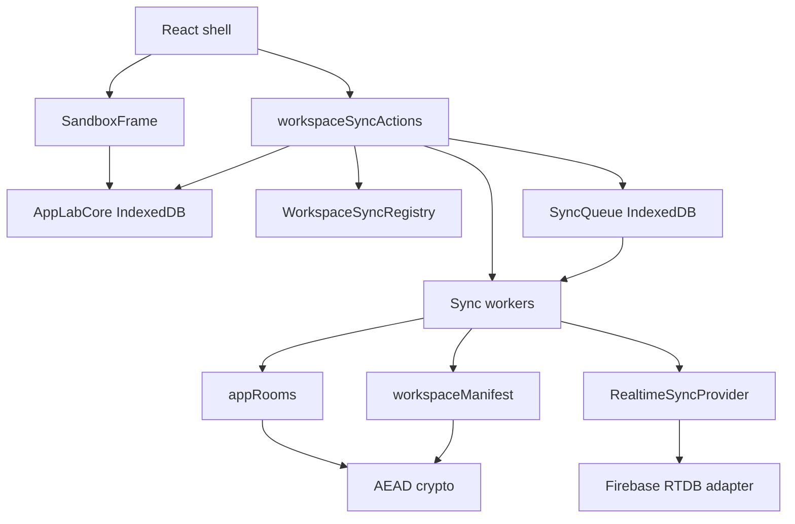
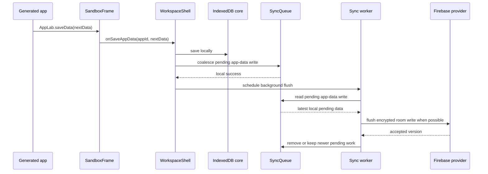

# App Lab Sync Architecture

This document describes the sync model currently used by App Lab. It is intentionally narrower than a general collaborative
editing system: generated apps store arbitrary JSON, while the host shell owns provider access, encryption, room metadata,
background retry, and conflict policy.

The core rule is:

> Generated apps call `AppLab.getData`, `AppLab.saveData`, and `AppLab.onDataChange`. They do not know about Firebase, rooms,
> recovery manifests, queue records, or encryption keys.

## Current Status

Implemented:

- encrypted Firebase Realtime Database rooms for app source, app data, and workspace recovery
- invite links for sharing apps
- import confirmation for shared app invites
- live subscriptions for active app source/data rooms
- local-first queue records for room creation, source saves, app-data saves, owned-app deletion, and workspace manifest saves
- relationship labels separate from cloud sync health
- Tailwind/Alpine-enabled example app and copy-paste prompt using `AppLab.onDataChange`
- Playwright/Firebase smoke coverage for the main sync paths

Not implemented:

- CRDT-style collaboration
- ID-based app-data merge
- read-only sharing
- revocation/key rotation
- source history/version review UI

## Layering



`src/ui` should call sync through `workspaceSyncActions`. UI code should not construct Firebase providers, encrypt room payloads,
or manually edit room records.

## File Responsibilities

`src/sync/types.ts`

- provider-neutral room and subscription interfaces
- room capability and snapshot types

`src/sync/firebaseRealtimeProvider.ts`

- Firebase Realtime Database adapter
- creates, loads, saves, deletes, and subscribes to rooms
- checks room access-token hashes before reads/writes/deletes
- enforces version checks through Firebase transactions

`src/sync/crypto.ts`

- encrypts/decrypts room payloads with AES-GCM
- authenticates room id, room type, and version
- rejects malformed or stale snapshots when local last-seen version is known

`src/sync/appRooms.ts`

- source-room and data-room payload definitions
- room creation, load, save, delete/tombstone helpers

`src/sync/workspaceSync.ts`

- local sync metadata registry
- storage profile, owned/joined app records, room capabilities, last-seen versions, tombstones, and sync health

`src/sync/syncQueue.ts`

- durable local queue for remote work that should eventually happen
- coalesces repeated source/data writes per app room

`src/sync/*Worker.ts`

- domain workers for room lifecycle, source, app data, owner deletion, and manifest writes
- workers are intentionally split because each domain has different conflict behavior

`src/sync/workspaceSyncActions.ts`

- facade used by the React shell
- coordinates local core, registry, queue, workers, invites, recovery, providers, and active subscriptions

`src/sync/invites.ts`

- invite encode/decode
- invite material lives in the URL fragment, not the HTTP request path

`src/sync/workspaceManifest.ts`

- encrypted workspace recovery material and manifest payload handling

## Room Model

App Lab uses one remote room primitive for three payload types:

```text
workspace-manifest room  -> encrypted workspace sync metadata
app-package/source room  -> encrypted app metadata, HTML source, and derived compiled CSS
app-data room            -> encrypted generated-app JSON data
```

A room capability is stored locally and in invite/recovery material:

```json
{
  "roomId": "room_abc",
  "decryptSecret": "base64url-256-bit-key",
  "accessToken": "room_access_random",
  "lastSeenVersion": 4
}
```

The Firebase record stores token hashes, version, timestamp, and encrypted payload. Firebase must not store decrypt secrets or raw
access tokens. The current adapter checks token hashes in client code before returning/deleting/writing a room, then uses Firebase
transactions for version checks. This is enough for the current trusted-client prototype, but it is not the same as provider-side
ACL enforcement.

Current sharing is full-access bearer sharing: anyone with the room capability can read, write, and forward it.

The provider type still has read/write token fields for compatibility with earlier code, but new rooms use the same access token
for both. App Lab should not present read-only sharing until a provider model can enforce it for real.

## Workspace Manifest And Recovery

Every browser has local workspace sync metadata. Without remote storage it is only local. With storage configured it can be backed
up to an encrypted workspace-manifest room.

```text
Local browser
  IndexedDB apps and app data
  local sync metadata
    workspace id
    storage profile
    owned app room capabilities
    joined app room capabilities
    last-seen versions

Firebase
  encrypted workspace-manifest room
  encrypted source rooms
  encrypted data rooms
```

Adding the same Firebase config on another device is not enough to restore apps. The second device needs recovery material so it
knows which manifest room to load and how to decrypt it.

Recovery material contains:

- provider reference
- manifest room capability
- an embedded point-in-time manifest snapshot

If IndexedDB is wiped and the user has not saved recovery material, Firebase access alone should not decrypt the workspace. That
is intentional: storing decrypt secrets in Firebase would remove the value of client-side encryption.

## Relationships

Relationship state answers "where does this app belong?"

- `Private`: owned by this workspace; no invite created
- `Shared by me`: owned by this workspace; invite created
- `Shared with me`: joined through someone else's invite

Routing rules:

- owned apps back up to this workspace's configured provider
- joined apps stay attached to the provider and rooms from the invite
- joined apps are not automatically mirrored into the recipient's provider

This distinction is mostly product routing, not strong ownership security. Invite links are full-access capabilities.

## Sync Health

Sync health answers "is the remote copy healthy?"

- no icon: local-only app, because there is no remote sync room to report on
- cloud check: this app is remote-backed and App Lab has no known queued local work for it
- cloud dots: local work is queued but not currently being flushed
- cloud spinner: a queued write is currently being flushed
- crossed cloud: local work is queued, but the browser or provider connection is offline/unavailable
- cloud alert: App Lab could not sync queued work or the remote app needs attention

Relationship labels and sync-health icons should remain separate in the UI.

The cloud check is a known-clean local state, not a guarantee that Firebase has no newer snapshot. It means:

- the app has source/data rooms in the sync manifest
- there is no pending queue item for that app
- no current sync error is known locally

Remote freshness is learned from normal pulls, subscriptions, startup wakeups, and provider events. App Lab does not constantly
prove freshness by polling every room.

The crossed cloud is based on sync reachability, not only `navigator.onLine`. A browser offline event makes sync unreachable, and
Firebase Realtime Database's own connection signal can also mark sync unreachable when the browser still reports online.

On reload, any abandoned `syncing` queue items are reset to `pending`. If sync is unreachable they should then present as crossed
cloud; if sync is reachable they may flush and move through spinner to checkmark.

Clicking a cloud icon should open a small status popover. The popover should describe the user-facing state first, with technical
details only where they help diagnose concrete issues such as a missing remote room.

## Save Flow



Local work happens first. Provider work is retried in the background when storage is configured, the browser is online, the app
starts, new local work is queued, or another provider operation finishes.

## Conflict Policy

Remote room versions are provider-accepted versions:

- local edits do not increment remote versions
- successful remote writes increment remote versions
- successful loads/subscriptions update local last-seen versions
- pending work records the base remote version it started from

Initial app-data policy:

> Latest local pending data wins.

If this browser was offline while another browser wrote newer remote data, the pending local data may overwrite the newer remote
data when connectivity returns. This is accepted for now because App Lab stores arbitrary generated-app JSON and does not yet have
a safe semantic merge engine.

Known risk:

```text
User A edits shared app data offline.
User B edits the same app data online.
User A reconnects.
User A's latest pending local data overwrites User B's remote data.
```

The expected first user experience is "simple and usually works", not perfect collaboration.

## Live Updates

Active app data subscriptions deliver remote changes to the iframe through:

```js
AppLab.onDataChange((nextData, info) => {
  // Update visible app state without resetting dialogs, tabs, scroll, or drafts.
});
```

The initial subscription snapshot is baseline state and should not show a warning. Later remote data changes should either be
handled by the app or shown as a reload-needed sync notice.

Source updates are more disruptive because they replace runnable code. Current behavior applies remote source updates and reloads
the sandbox. Source collaboration is trusted collaboration.

## Deletion

Local-only app:

- delete local app and local app data

Owned synced app:

- remove locally immediately
- queue remote source/data room deletion or tombstone cleanup
- collaborators see a deleted/missing shared app state when their subscriptions/load checks observe it

Joined app:

- remove local joined app metadata and local copy
- owner rooms are untouched
- other collaborators are unaffected

## Firebase Setup

The prototype Firebase rules are intentionally simple:

```json
{
  "rules": {
    "appLabSyncRooms": {
      "$roomId": {
        ".read": true,
        ".write": true
      }
    }
  }
}
```

Security is primarily from unguessable room ids, bearer access tokens, and client-side encryption. This is acceptable for the
current proof-of-concept, but stronger provider-side authorization would be needed before treating room tokens as an enforcement
boundary against malicious clients or before presenting granular permissions.

## Future Merge Extension

If real shared/offline conflicts become common, App Lab can add an ID-based merge engine inside the app-data worker without
changing the generated-app runtime API.

The future worker would compare:

- `base`: last remote data this browser accepted
- `local`: newest local pending data
- `remote`: newest provider data

Likely rules:

- objects merge recursively
- arrays of objects with stable `id` merge by `id`
- records with different IDs coexist
- same field changed on both sides falls back to latest-local-wins
- arrays without stable IDs fall back to latest-local-wins

Generated apps do not need to use UUIDs today, but apps with stable record IDs will be easier to merge later if this becomes
important.

## Testing Strategy

The sync layer should be verified at several levels:

- unit tests for crypto, manifests, invites, queue behavior, and workers
- memory-provider tests for deterministic conflict/queue scenarios
- Firebase smoke tests for real provider semantics
- Playwright tests for local persistence, sharing/import, live source/data sync, offline retry, and deletion behavior

The most important product-level checks are:

- app creation and editing stay local-first
- source and data changes eventually propagate after reconnect
- repeated offline app-data saves coalesce instead of blocking after one edit
- joined apps stay on the owner's provider
- owner deletion removes remote rooms or marks the shared app deleted
