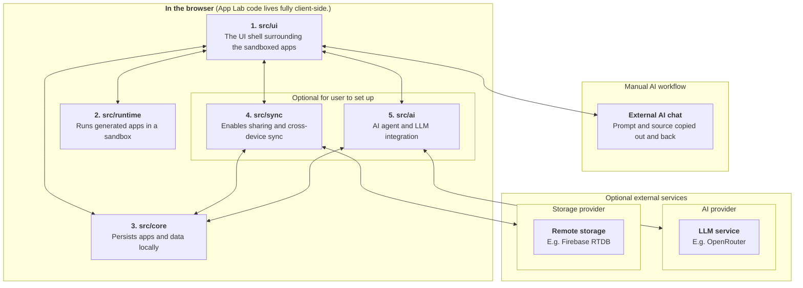

# Developer Guide

App Lab is a React 18 and TypeScript application built with Vite and deployed as static files. The browser hosts the workspace,
runs generated apps, and stores their source and data. Storage and LLM providers are optional browser-to-service integrations;
App Lab has no required application backend.

The codebase is local-first. `src/core` keeps the working copy in IndexedDB, `src/runtime` executes each generated HTML document
inside a sandbox, and `src/ui` coordinates user actions. `src/sync` and `src/ai` extend that local workspace through public
contracts.

## Start Here

| Need | Read |
| --- | --- |
| Use the product | [User guide](./user-guide.md) |
| Understand a module | [UI](./ui.md), [Runtime](./runtime.md), [Core](./core.md), [Sync](./sync.md), [AI](./ai.md) |
| Review the trust model | [Security](../SECURITY.md) |
| Run a release | [Deployment](./deploy.md) |

## Architecture

Three rules shape the repository:

1. **Local state works alone.** Optional services extend the workspace; they do not replace its browser copy.
2. **Generated source stays untrusted.** It runs outside the host and receives only a narrow bridge to its own JSON data.
3. **Module boundaries stay explicit.** Production consumers import a module through its `index.ts`; dependency-cruiser enforces
   the current boundaries.

The product areas are:

1. **UI** is the menu and host around generated apps. It coordinates user actions across the other areas.
2. **Runtime** runs generated app source and only knows the values and callbacks supplied by UI.
3. **Core** stores app source, app data, and metadata locally in IndexedDB.
4. **Sync** adds encrypted backup, sharing, and cross-device updates through a storage provider.
5. **AI** lets the agent edit app source through an LLM provider.



The diagram maps responsibilities rather than every call. `App.tsx` wires public module contracts into UI, while explicit
commands and callbacks keep each write's origin visible and avoid sync loops.

## Vocabulary

| Term | Meaning |
| --- | --- |
| Generated app | One self-contained HTML document stored and run by App Lab. |
| Host | The trusted React interface surrounding generated apps. |
| Workspace | The apps and relationships kept together in this browser. |
| App source | A generated app's complete HTML document; `AppRecord` adds its metadata, compiled CSS, and timestamps. |
| App data | JSON saved by a generated app through `window.AppLab`. |
| Storage provider | A remote room service behind `RealtimeSyncProvider`, such as Firebase RTDB. |
| Storage profile | `StorageProfile` in code: this browser's configuration for a storage provider. |
| Sync relationship | `AppSyncRecord` in code: how one local app maps to owned, joined, or private-copy rooms. |
| Room | One encrypted remote unit containing a workspace manifest, app source, or app data. |
| Room capability | `RoomCapability` in code: a room's id, secrets, access material, and observed version. |
| Workspace manifest | Sync relationships, room versions, and deletion tombstones for one workspace. |
| Workspace sync material | User-carried recovery text represented by `WorkspaceRecoveryMaterial` in code. |

## Modules

| Area | Responsibility | Public boundary |
| --- | --- | --- |
| [`src/ui`](./ui.md) | Render the host and coordinate user actions. | `WorkspaceShell` |
| [`src/runtime`](./runtime.md) | Build and supervise isolated generated-app and compiler frames. | `SandboxFrame`, `compileAppStyles` |
| [`src/core`](./core.md) | Own the local app and app-data working copy. | `AppLabCore` |
| [`src/sync`](./sync.md) | Add encrypted rooms, queues, sharing, and workspace recovery. | `WorkspaceSyncActions` |
| [`src/ai`](./ai.md) | Own AI configuration, conversations, model context, and the agent loop. | AI module contract |

## Develop

```bash
pnpm install
pnpm hooks:install
pnpm dev
```

Before committing:

```bash
pnpm check
pnpm test:e2e
```

`pnpm check` runs dependency rules, unit tests, TypeScript, and the production build. Firebase-backed checks load
`.env.test.local` using the shape in [`.env.test.local.example`](../.env.test.local.example):

```bash
pnpm test:firebase-smoke
pnpm test:firebase-e2e
```

The paid OpenRouter browser check is also opt-in. It loads the capped test key from `.env.test.local`, while the test chooses its
model in code. It is excluded from `pnpm check` and `pnpm test:e2e`:

```bash
pnpm test:openrouter-e2e
```

Treat IndexedDB schemas, `window.AppLab`, invites, workspace sync material, encrypted rooms, and manifest payloads as compatibility
contracts. Prefer additive parsing or an explicit migration when a stored or shared shape changes.
