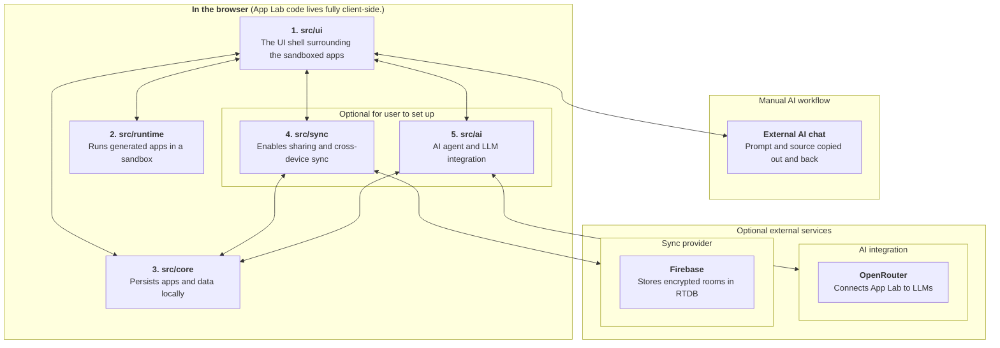

# Developer Guide

This is the technical map of App Lab. It starts with the vocabulary and top-level modules, then points to deeper documents only
where the design needs more explanation than the code can provide.

## Glossary

### In The Workspace

- **Host:** The App Lab interface surrounding the generated apps.
- **Workspace:** The collection of apps kept together by App Lab.
- **App / generated app:** The apps that the user creates or generates with AI in AppLab.
- **App source:** The complete HTML document that defines an app.
- **App data:** The JSON an app saves through `window.AppLab`.

### Product Areas

- **UI (`src/ui`):** The host interface and coordinator for user actions.
- **Runtime (`src/runtime`):** The sandbox (iFrame) where generated source runs and communicates through `window.AppLab`.
- **Core (`src/core`):** The `AppLabCore` contract for local persistence (IndexedDB) implementation.
- **Sync (`src/sync`):** Optional backup, sharing, and cross-device synchronization through `WorkspaceSyncActions`.
- **AI (`src/ai`):** The agent, AI conversation, and connection to an LLM.

### When Sync Is Enabled

- **Storage profile (`StorageProfile`):** The browser's connection to the user's storage provider (eg. Firebase).
- **Sync room:** One encrypted remote unit containing a workspace manifest, app source, or app data.
- **Owned app:** An app created in this workspace.
- **Joined app:** An app imported from another person's invite.
- **Workspace sync material (`WorkspaceRecoveryMaterial` in code):** Sensitive text that lets another browser restore and continue
  syncing the workspace.

## Architecture Map

App Lab is divided into different product areas. these are always in use:

1. **UI** is the menu and host around generated apps. It coordinates user actions across the other areas.
2. **Runtime** is where generated app source runs and appears on screen. It only knows the values and callbacks supplied by UI.
3. **Core** stores app source, app data, and app metadata locally in IndexedDB.

These areas are optional and in use if the user sets up integration to a storage provider (for sync) or a LLM provider (for AI):

4. **Sync** extends App Lab's [local-first model](https://en.wikipedia.org/wiki/Local-first_software) with encrypted backup, app
   sharing, and cross-device sync. E.g. via integration to Firebase Realtime Database external provider.
5. **AI** lets App Lab's own agent update app source directly. Integration to LLM provider (e.g. OpenRouter) can connect the agent to the user's chosen LLM.

The diagram below has the above numbers written out. The arrows indicate how the different areas interact with each other.



## Modules

### 1. `src/ui`

**Purpose:** Coordinate user actions and render the workspace around the active app.

**Owns:** React state, launcher and app views, tools, dialogs, and the ordering of local and optional remote actions.

### 2. `src/runtime`

**Purpose:** Run generated source without giving it access to the host application.

**Owns:** Sandbox document construction, iframe capabilities, the `window.AppLab` bridge (which lets the sandboxed app communicate with the host via `postMessage` to save and subscribe to data changes), console forwarding, and host-compiled
Tailwind support.

### 3. `src/core`

**Purpose:** Provide the local source of truth for apps and their JSON data.

**Owns:** `AppLabCore`, app records, HTML metadata, IndexedDB persistence, and the in-memory test implementation.

### 4. `src/sync`

**Purpose:** Extend the local workspace with encrypted backup, device sync, and app sharing.

**Owns:** The public sync actions, local sync metadata, durable queues, encrypted rooms, provider adapters, invites, recovery, and
conflict policy.

[Read the sync design](./sync.md)

### 5. `src/ai`

**Purpose:** Bring the current external-AI workflow into App Lab through an LLM provider (e.g. OpenRouter).

**Owns:** AI configuration, per-app conversations, bounded model context, and the agent loop.

[Read the AI integration brief](./ai-integration.md)

## Three Important Flows

Each flow keeps UI responsible for coordination while the modules retain their own rules:

```text
Manual source edit (user clicks "Save" in source code view):
      UI -> runtime compiler -> core -> sync

Remote source update (e.g. another user makes a change to the source code of an app):
      Storage provider (e.g. Firebase) -> sync -> core -> UI -> runtime

Generated app data (user clicks a button in app which changes app's data):
        runtime -> UI callback -> core -> sync
```

Core is always the local source of truth. Sync writes remote changes through the same `AppLabCore` object that UI uses. UI updates
React state after local commands and sync callbacks; IndexedDB is not treated as a general event bus.

## Engineering Guide

### Local Setup

```bash
pnpm install
pnpm hooks:install
pnpm dev
```

`pnpm hooks:install` activates the tracked pre-commit hook for this clone.

### Verification

```bash
pnpm check
pnpm test:e2e
```

`pnpm check` enforces module boundaries, runs unit tests and TypeScript, and builds the production app. `pnpm test:e2e` runs local
browser workflows without Firebase credentials.

Real Firebase checks load `.env.test.local`; copy its shape from
[`.env.test.local.example`](../.env.test.local.example):

```bash
pnpm test:firebase-smoke
pnpm test:firebase-e2e
```

The smoke suite checks low-level provider and RTDB-rule behavior. The Firebase E2E suite checks complete browser workflows such
as offline edits, live updates, deletion, recovery, and workspace conflicts.

### Module Boundaries

Production code outside a top-level module must import through that module's `index.ts`. Tests may reach internals for focused
coverage. `pnpm deps:check` enforces the boundary, including type-only imports.

Generate a compact module graph with `pnpm deps:graph` or a file-level graph with `pnpm deps:graph:files`. Both outputs are ignored
by Git.

### Compatibility

Treat persisted and shared formats as contracts, even when TypeScript types make a code change look local:

- IndexedDB database names, versions, app records, and queue records may outlive a release.
- Invite, recovery, encrypted-room, and workspace-manifest payloads may be opened by another version or browser.
- `window.AppLab` is the generated-app API and should remain backward compatible.
- Firebase rule changes must preserve access for existing apps or include an explicit migration path.

Prefer additive parsing and migrations over silently changing stored shapes. Compatibility-sensitive changes deserve tests using
older serialized examples and, for sync, the real Firebase suites.

### Security And Deployment

[Security](../SECURITY.md) defines the trust model and sensitive material. [Deployment](./deploy.md) explains the static GitHub
Pages release process. The [backlog](./backlog.md) records current planning but is not part of the required reading path.
