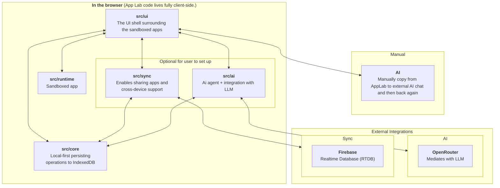

# Developer Guide

This is the technical map of App Lab. It starts with the vocabulary and top-level modules, then points to deeper documents only
where the design needs more explanation than the code can provide.

## Glossary

| Term | Meaning |
| --- | --- |
| **Workspace** | The collection of apps and workspace-owned settings in one browser. |
| **App** | One HTML source document, its launcher metadata, and its app-owned JSON data. |
| **Host** | The App Lab React application surrounding generated apps. |
| **Generated app** | User or AI-provided source that runs inside the sandbox. |
| **Core** | The `AppLabCore` contract and local persistence implementation. |
| **Runtime** | The sandbox boundary and the `window.AppLab` bridge available inside an app. |
| **Sync room** | One encrypted remote unit containing a workspace manifest, app source, or app data. |
| **Storage profile** | This browser's connection to the user's Firebase project. |
| **Owned app** | An app created in this workspace. |
| **Joined app** | An app imported from another person's invite. |
| **Recovery material** | Sensitive text that lets another browser restore and continue syncing the workspace. |

## Architecture Map

Every `src/...` node inside the browser represents one top-level product module. The arrows describe deliberate module
interaction, not every callback or type import. Runtime remains a leaf because it only knows the values and callbacks supplied by
UI.



`src/jsonData.ts` contains the shared JSON contract and normalization used by core and sync. It is a shared primitive rather than
another product module, so it is intentionally not a node in this map.

## Modules

### `src/ui`

**Purpose:** Coordinate user actions and render the workspace around the active app.

**Owns:** React state, launcher and app views, tools, dialogs, and the ordering of local and optional remote actions.

**Public contract:** `src/ui/index.ts`.

**Does not own:** IndexedDB details, Firebase providers, encryption, or sandbox internals.

### `src/core`

**Purpose:** Provide the local source of truth for apps and their JSON data.

**Owns:** `AppLabCore`, app records, HTML metadata, IndexedDB persistence, and the in-memory test implementation.

**Public contract:** `src/core/index.ts`.

**Does not own:** React state, source execution, remote providers, or sync policy.

### `src/runtime`

**Purpose:** Run generated source without giving it access to the host application.

**Owns:** Sandbox document construction, iframe capabilities, the `window.AppLab` bridge, console forwarding, and host-compiled
Tailwind support.

**Public contract:** `src/runtime/index.ts`.

**Does not own:** Local persistence or sync. UI supplies narrow read/write callbacks without runtime knowing their implementation.

### `src/sync`

**Purpose:** Extend the local workspace with encrypted backup, device sync, and app sharing.

**Owns:** The public sync actions, local sync metadata, durable queues, encrypted rooms, provider adapters, invites, recovery, and
conflict policy.

**Public contract:** `src/sync/index.ts`. The browser factory receives the same `AppLabCore` instance used by UI.

**Does not own:** Generated app behavior, React presentation, or the local app model.

[Read the sync design](./sync.md)

### `src/ai` (planned)

**Purpose:** Bring the current external-AI workflow into App Lab through OpenRouter.

**Will own:** AI configuration, per-app conversations, bounded model context, and the agent loop.

**Planned public contract:** `src/ai/index.ts`. UI will supply narrow tools so AI source edits use the same save path as manual
edits.

**Will not own:** IndexedDB app persistence, source sync, or sandbox execution.

[Read the AI integration brief](./ai-integration.md)

## Three Important Flows

Each flow keeps UI responsible for coordination while the modules retain their own rules:

```text
Manual source edit   UI -> runtime compiler -> core -> sync
Remote source update Firebase -> sync -> core -> UI -> runtime
Generated app data   runtime -> UI callback -> core -> sync
```

Core is always the local source of truth. Sync writes remote changes through the same `AppLabCore` object that UI uses. UI updates
React state after local commands and sync callbacks; IndexedDB is not treated as a general event bus.

## Engineering Guide

### Local Setup

```bash
pnpm install
pnpm hooks:install
pnpm dev
```

`pnpm hooks:install` activates the tracked pre-commit hook for this clone.

### Verification

```bash
pnpm check
pnpm test:e2e
```

`pnpm check` enforces module boundaries, runs unit tests and TypeScript, and builds the production app. `pnpm test:e2e` runs local
browser workflows without Firebase credentials.

Real Firebase checks load `.env.test.local`; copy its shape from
[`.env.test.local.example`](../.env.test.local.example):

```bash
pnpm test:firebase-smoke
pnpm test:firebase-e2e
```

The smoke suite checks low-level provider and RTDB-rule behavior. The Firebase E2E suite checks complete browser workflows such
as offline edits, live updates, deletion, recovery, and workspace conflicts.

### Module Boundaries

Production code outside a top-level module must import through that module's `index.ts`. Tests may reach internals for focused
coverage. `pnpm deps:check` enforces the boundary, including type-only imports.

Generate a compact module graph with `pnpm deps:graph` or a file-level graph with `pnpm deps:graph:files`. Both outputs are ignored
by Git.

### Compatibility

Treat persisted and shared formats as contracts, even when TypeScript types make a code change look local:

- IndexedDB database names, versions, app records, and queue records may outlive a release.
- Invite, recovery, encrypted-room, and workspace-manifest payloads may be opened by another version or browser.
- `window.AppLab` is the generated-app API and should remain backward compatible.
- Firebase rule changes must preserve access for existing apps or include an explicit migration path.

Prefer additive parsing and migrations over silently changing stored shapes. Compatibility-sensitive changes deserve tests using
older serialized examples and, for sync, the real Firebase suites.

### Security And Deployment

[Security](../SECURITY.md) defines the trust model and sensitive material. [Deployment](./deploy.md) explains the static GitHub
Pages release process. The [backlog](./backlog.md) records current planning but is not part of the required reading path.
