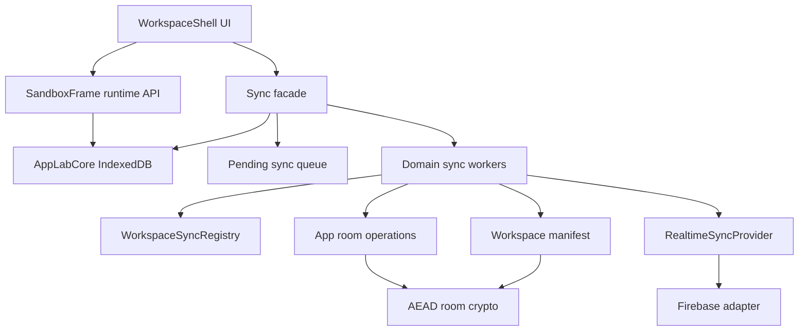

# App Lab Sync: Next Version

This is a design proposal for the next sync iteration. It is not the current implementation. The goal is to separate the different
kinds of sync, make local-first behavior explicit, and add a realistic path toward better conflict handling without giving
generated apps direct access to Firebase or provider details.

## Product Goal

App Lab should feel local-first:

- apps are always usable from IndexedDB when the browser can load App Lab
- local actions should update the UI immediately
- remote sync should happen in the background
- bad connectivity should not block normal app creation, editing, or deletion where the action can be represented locally
- conflicts should be rare, understandable, and handled according to clear rules

The system should keep this architectural rule:

> Generated apps use App Lab runtime APIs. The host shell owns storage providers, encryption, room capabilities, retry queues, and
> conflict policy.

Generated apps should not talk directly to Firebase, TanStack, provider tokens, encrypted rooms, or sync manifests.

## Why Sync Must Be Split

"Sync" is not one problem in App Lab. Different data has different semantics.

```text
Sync engine
  workspace/app registry sync
    - which apps exist
    - owned vs joined apps
    - room references
    - workspace recovery manifest

  room lifecycle sync
    - create source/data rooms
    - delete/tombstone source/data rooms
    - retry idempotent remote setup

  source code sync
    - app HTML source
    - app name/description metadata
    - latest write wins for now

  app data sync
    - arbitrary generated-app JSON
    - local-first pending writes
    - latest local write wins for now
    - record-ID merge can be added later

  realtime subscriptions
    - incoming data changes for active apps
    - incoming source changes/deletions
```

These workers can share provider adapters, encryption helpers, room capabilities, and local metadata. They should not share one
giant sync algorithm.

## Layering



The important boundary is between UI/runtime and sync domain workers:

- UI/runtime records local intent.
- Local core stores the local state immediately.
- Sync workers eventually make the remote provider match the intended state.

## Version Semantics

Remote room versions are provider-accepted versions.

Rules:

- local edits do not increment remote room versions
- a successful provider write increments the remote room version
- a successful remote load/subscription updates the local last-seen remote version
- queued work records the remote version it was based on

Example pending app-data write:

```ts
interface PendingAppDataWrite {
  kind: "app-data-write";
  appId: string;
  roomId: string;
  baseRemoteVersion: number;
  baseData: JsonValue;
  localData: JsonValue;
  createdAt: string;
}
```

If the provider still has `baseRemoteVersion`, the pending write can upload directly. If the provider has a newer version, the
first local-first version still saves the latest local data. Later, the same pending shape can support ID-based merge.

## Rooms, Capabilities, And Recovery

App Lab uses the same room primitive for three different payload types:

```text
workspace-manifest room
  -> encrypted workspace sync metadata

app-package/source room
  -> encrypted app metadata and source HTML

app-data room
  -> encrypted generated-app JSON data
```

A remote room record contains provider-visible metadata and encrypted payload:

```json
{
  "roomId": "room_...",
  "version": 4,
  "updatedAt": "2026-06-25T10:00:00.000Z",
  "accessTokenHash": "sha256...",
  "encryptedPayload": "{\"schemaVersion\":1,\"algorithm\":\"AES-GCM\",...}"
}
```

The provider can see room IDs, room versions, timestamps, token hashes, and encrypted payload strings. It should not see decrypted
source, decrypted app data, decrypt secrets, or raw access tokens.

### Capability Shape

A local room capability is the information App Lab needs to use one room:

```json
{
  "roomId": "room_abc",
  "decryptSecret": "base64url-256-bit-key",
  "accessToken": "room_access_random",
  "lastSeenVersion": 4
}
```

Meanings:

- `roomId`: remote room path/id
- `decryptSecret`: AES-GCM key material for decrypting and encrypting that room's payload
- `accessToken`: bearer capability used to load, subscribe, save, and delete the room
- `lastSeenVersion`: newest provider-accepted room version known locally

The next version should treat invites as full-access bearer capabilities. If someone has the room capability, they can read, write,
and forward it. This matches the current practical sharing model and avoids pretending that App Lab can provide read-only sharing
without provider-enforced authorization.

Current code still has `readToken`, `writeToken`, and `permission` fields. Those are legacy from an earlier design that explored
read-only/write sharing. With the current broad Firebase prototype rules, that distinction is not a product-level security
boundary. A cleanup pass should collapse the next model toward one full-access room token unless provider-enforced read-only
sharing becomes a real requirement later.

If a future provider can genuinely enforce read-only access, add it as a deliberate second sharing mode. Do not keep semi-enforced
read/write distinctions in the normal model.

### Workspace Manifest

The workspace manifest is an encrypted room containing the map to the workspace.

Example decrypted manifest payload:

```json
{
  "schemaVersion": 1,
  "workspaceId": "workspace_123",
  "storageProfile": {
    "profileId": "profile_abc",
    "provider": "firebase-rtdb",
    "displayName": "My Firebase",
    "databaseUrl": "https://example.europe-west1.firebasedatabase.app"
  },
  "apps": {
    "app_gym": {
      "kind": "owned",
      "appId": "app_gym",
      "storageProfileId": "profile_abc",
      "shareState": "invite-created",
      "sourceRoom": {
        "roomId": "room_source",
        "decryptSecret": "...",
        "accessToken": "...",
        "lastSeenVersion": 7
      },
      "dataRoom": {
        "roomId": "room_data",
        "decryptSecret": "...",
        "accessToken": "...",
        "lastSeenVersion": 12
      }
    },
    "app_friend": {
      "kind": "joined",
      "appId": "app_friend",
      "sourceProvider": {
        "provider": "firebase-rtdb",
        "databaseUrl": "https://friend-project.europe-west1.firebasedatabase.app"
      },
      "dataProvider": {
        "provider": "firebase-rtdb",
        "databaseUrl": "https://friend-project.europe-west1.firebasedatabase.app"
      },
      "sourceRoom": { "roomId": "room_friend_source", "decryptSecret": "...", "accessToken": "...", "lastSeenVersion": 3 },
      "dataRoom": { "roomId": "room_friend_data", "decryptSecret": "...", "accessToken": "...", "lastSeenVersion": 9 }
    }
  },
  "deletedApps": {},
  "updatedAt": "2026-06-25T10:00:00.000Z"
}
```

The manifest may contain room capabilities for owned apps and joined apps. That means restoring the manifest restores the map to
all source/data rooms the workspace knows about.

### Manifest Lifecycle

Every App Lab workspace should have local sync metadata, even before remote storage is configured. Without remote storage, that
metadata is local-only and lives in browser storage alongside the local apps.

Local-only workspace:

```text
IndexedDB / browser storage
  local apps
  local app data
  local sync metadata
    workspaceId
    no storageProfile
    no remote manifest room
    no owned remote source/data rooms
```

Remote-backed workspace:

```text
IndexedDB / browser storage
  local apps
  local app data
  local sync metadata
    workspaceId
    storageProfile
    manifestRoom capability
    owned/joined app room capabilities

Firebase
  encrypted manifest room
  encrypted source rooms
  encrypted data rooms
```

The local sync metadata is the working copy. The remote manifest room is the encrypted backup/cross-device copy of that metadata.

When a user configures remote storage:

1. App Lab creates or reuses a local `workspaceId`.
2. App Lab creates a manifest room capability.
3. App Lab creates room capabilities for owned local apps.
4. App Lab writes encrypted source/data rooms.
5. App Lab writes the encrypted manifest room.
6. App Lab can export recovery material for the manifest room.

When a user restores another device:

1. User provides recovery material.
2. App Lab loads and decrypts the remote manifest room.
3. App Lab stores that manifest as local sync metadata.
4. App Lab loads/decrypts app source/data rooms referenced by the manifest.
5. Apps appear locally and continue syncing through their referenced rooms.

The manifest is not a server-enforced account record. It is encrypted workspace metadata controlled by whoever has the recovery
material or local browser storage.

### Recovery Material

Recovery material is the map to the encrypted manifest room:

```json
{
  "kind": "app-lab-workspace-recovery",
  "schemaVersion": 1,
  "workspaceId": "workspace_123",
  "provider": {
    "provider": "firebase-rtdb",
    "databaseUrl": "https://example.europe-west1.firebasedatabase.app",
    "firebaseConfig": {
      "apiKey": "...",
      "databaseURL": "https://example.europe-west1.firebasedatabase.app"
    }
  },
  "manifestRoom": {
    "roomId": "room_manifest",
    "decryptSecret": "...",
    "accessToken": "...",
    "lastSeenVersion": 4
  }
}
```

Recovery chain:

```text
recovery material
  -> provider config + manifest room capability
  -> load encrypted manifest room
  -> decrypt manifest
  -> get source/data room capabilities
  -> load/decrypt apps and app data
```

If IndexedDB is wiped and the user has not saved recovery material, Firebase access alone should not be enough to restore the
encrypted workspace. This is intentional. Storing decrypt secrets in Firebase would make Firebase account access equivalent to
workspace decryption and would remove the value of client-side encryption.

## Pending Sync Queue

The queue is local, durable, and stored in IndexedDB.

It contains remote work that should eventually happen:

```text
pending queue
  ensure-app-rooms
  save-source
  save-app-data
  delete-owned-app
  save-workspace-manifest
```

The queue processor should wake up when any of these events happen:

- storage is configured
- the browser reports online
- the app starts
- a local app lifecycle, source, or data change enqueues new work
- an in-flight provider operation finishes and the worker can continue draining queued work

TanStack Query could be used as the retry/mutation runner, especially for pause/resume/retry behavior. Even if TanStack is used,
App Lab still needs its own queue record shapes and conflict policy because TanStack cannot know what an App Lab room write means.

## Room Lifecycle Worker

Room lifecycle work is structured and mostly idempotent.

Creating an app while storage is configured:

1. create the app locally
2. generate `appId`, source room capability, and data room capability locally
3. save local sync metadata
4. enqueue `ensure-app-rooms`
5. UI can open the app immediately
6. worker creates remote rooms when possible

Retry rule:

- if the room already exists with compatible tokens, treat that as success
- if the room exists with incompatible tokens, mark sync error

This is one of the safest first places for a background queue because there is no meaningful merge conflict. The app and room IDs
are already chosen locally.

## Source Code Worker

Source code is one document. App Lab should not try to merge generated HTML.

Initial source sync rule:

> Latest successful remote source write wins.

Behavior:

- local source save updates IndexedDB immediately
- enqueue `save-source`
- remote save uses the latest known source-room version when possible
- if remote source changed first, overwrite according to latest-write-wins policy
- active iframe may need a reload after applied source changes

Future improvements can add:

- source version history
- compare/apply UI
- restore previous version
- "remote source changed" warning before overwrite

These should not block the next sync iteration.

## App Data Worker

App data is the hard part because generated apps can store arbitrary JSON.

The immediate goal is not perfect merge. The immediate goal is local-first reliability:

> `AppLab.saveData` should save locally, enqueue the latest desired remote state, and let the background worker flush it when
> possible.

Initial conflict policy:

> Latest local pending app data wins.

That means if the remote data changed while this device was offline or still syncing, the next version initially overwrites with
the latest local pending data. This can lose concurrent remote changes, but it keeps the app usable and avoids user-facing merge
dialogs in the first local-first iteration.

### Pending App Data Shape

Even though the first policy is latest-local-wins, the pending record should preserve the information needed for future merging:

```ts
interface PendingAppDataWrite {
  kind: "app-data-write";
  appId: string;
  roomId: string;
  baseRemoteVersion: number;
  baseData: JsonValue;
  localData: JsonValue;
  localRevision: number;
  inFlightRevision: number | null;
  status: "pending" | "syncing" | "problem";
}
```

Rules:

- keep one pending app-data write per app data room
- each local save updates `localData` and increments `localRevision`
- preserve the original `baseData` and `baseRemoteVersion` until the pending write is accepted remotely
- if a local save happens while a provider write is in flight, keep the pending record and flush again after the current attempt
- if the provider is unavailable, keep the pending record and retry later

This is the same path online and offline. Online just means the queue usually drains quickly.

### Flush Sketch

```ts
async function saveAppData(appId, nextData) {
  await core.saveAppData(appId, nextData);
  await queue.coalesceAppDataWrite(appId, nextData);
  scheduleFlushSoon();
}

async function flushAppData(appId) {
  const pending = await queue.getAppDataWrite(appId);
  if (!pending || pending.status === "syncing") return;

  const inFlightRevision = pending.localRevision;
  await queue.markSyncing(appId, inFlightRevision);

  const latestRemote = await provider.loadRoom(pending.roomId);
  const saved = await provider.saveRoom({
    expectedVersion: latestRemote.version,
    data: pending.localData
  });

  const newestPending = await queue.getAppDataWrite(appId);
  if (!newestPending) return;

  if (newestPending.localRevision === inFlightRevision) {
    await queue.remove(appId);
    await syncRegistry.rememberRemoteVersion(appId, saved.version, pending.localData);
  } else {
    await queue.updateBaseAfterPartialFlush(appId, saved.version, pending.localData);
    scheduleFlushSoon();
  }
}
```

The important safety check is `localRevision === inFlightRevision`. It prevents a newer local edit from being removed by an older
successful remote write.

### Future ID-Based Merge Extension

If App Lab later adds ID-based merge, apps that already model list items as records with stable IDs will be easier to merge. This
is not required for the first local-first version.

Example of a future-merge-friendly shape:

```json
{
  "ideas": [
    {
      "id": "f8d8e6f3-2db0-4e3b-a4f7-7b6fa5b8267d",
      "title": "Build sync",
      "color": "purple"
    }
  ]
}
```

Useful conventions if a future app needs better merge behavior:

- arrays of records should use stable high-entropy IDs, preferably `crypto.randomUUID()`
- nested records may also use stable `id`
- use an app-owned `schemaVersion` only when the generated app needs to migrate its own data shape
- avoid arrays of primitives for collaborative data
- avoid using array position as identity
- keep transient UI state out of persisted data

App Lab itself should wrap app data in a host-owned sync envelope with its own schema/version metadata. That wrapper belongs to
the shell and sync engine. The generated app's data can also contain `schemaVersion`, but that means "this app's data model
version", not "App Lab sync protocol version".

App-owned schema versions are useful when an app changes from one internal data shape to another, for example from `{ items: [] }`
to `{ boards: [] }`. They are not required for the host's generic merge rules.

The future merge strategy would use the same pending queue record, but replace latest-local-wins at one point in the app-data
worker:

```ts
if (latestRemote.version === pending.baseRemoteVersion) {
  dataToSave = pending.localData;
} else {
  dataToSave = mergeById({
    base: pending.baseData,
    local: pending.localData,
    remote: latestRemote.data
  });
}
```

The merge function would compare three snapshots:

- `base`: the last remote data this browser had accepted when local edits began
- `local`: the newest local pending app data
- `remote`: the newest provider data

Probable merge rules:

- objects merge recursively
- arrays of objects with stable `id` merge by `id`
- records with different IDs coexist
- same field changed on both sides falls back to latest-local-wins or latest queued write
- arrays without stable IDs and primitive values fall back to latest-local-wins

This should be additive if the pending record keeps `baseData`, `baseRemoteVersion`, and `localData` from the start. The first
local-first implementation should not build the merge engine yet.

Known risk in the first local-first version:

```text
User A goes offline and edits shared app data.
User B stays online and edits the same shared app data.
User A comes back online.
User A's latest local pending data overwrites User B's newer remote data.
```

This is the main product risk of latest-local-wins. It is accepted for the first local-first version to avoid building a merge
engine before there is evidence that shared offline conflicts are common enough to justify the complexity.

## Workspace Manifest Worker

The workspace manifest is host-owned structured data.

It should track:

- storage profile reference
- owned app sync records
- joined app sync records
- room capabilities
- local tombstones for apps
- last-seen remote room versions

Manifest writes can be queued and retried. Conflicts should use host-defined merge rules, not generated-app JSON rules.

Reasonable manifest merge:

- owned app records merge by `appId`
- joined app records merge by `appId`
- tombstones merge by `appId`
- if the same app record changed on two devices, latest manifest write wins for that app record

Adding the same Firebase config on another device should not be considered enough to restore a workspace. Restore should use
workspace recovery material as described in "Rooms, Capabilities, And Recovery".

## Runtime API

Keep generated app APIs simple:

```js
const data = await AppLab.getData(defaultData);

await AppLab.saveData(nextData);

AppLab.onDataChange((nextData, info) => {
  // Update the visible data model without resetting view state.
});
```

The example app and app-building prompt should show `saveData` with merge-friendly JSON: records in arrays get UUID-style IDs,
and transient UI state stays outside persisted data.

## Sharing Mechanics

Sharing is capability-based.

User-facing flow:

1. Owner creates or opens an app.
2. Owner configures remote storage if the app does not already have remote rooms.
3. App Lab creates or reuses source/data room capabilities.
4. App Lab creates an invite link containing provider info plus source/data room capabilities.
5. Recipient opens the invite link.
6. Recipient confirms import.
7. App Lab loads/decrypts the source/data rooms and stores a joined app record locally.

Technical flow:

```text
invite link
  -> provider reference
  -> source room capability
  -> data room capability

import invite
  -> load source room using source capability
  -> decrypt source room
  -> load data room using data capability
  -> decrypt data room
  -> create local joined app record
```

In the current full-access bearer model, the invite is the authority. A joined user who has the invite can forward it. A joined
user who has the local room capabilities can also manipulate local metadata in IndexedDB.

Relationship labels such as `Private`, `Shared by me`, and `Shared with me` are workspace-local metadata. They are important for
sync routing and user understanding, but they are not a server-enforced security boundary in this model.

Sync routing rules:

- owned/private apps are backed up to this workspace's configured storage provider
- shared-by-me apps are owned apps whose invite has been created; they still back up to this workspace's provider
- shared-with-me apps stay attached to the provider and rooms from the invite
- shared-with-me apps must not be automatically mirrored into the recipient's own storage provider

Example:

```text
User A storage profile
  owns Gym App
  source/data rooms live in User A Firebase

User B imports Gym App
  local relationship = Shared with me
  source/data rooms still point to User A Firebase
  User B's own Firebase profile does not receive a backup copy
```

This routing is the main reason App Lab tracks relationship state. The UI should make it visible so users understand which apps
live in their own storage and which apps live in someone else's storage.

A technically capable user can edit their own IndexedDB and make a joined app appear as owned locally. That can confuse or alter
local routing behavior, but it should not grant new remote power beyond the room capabilities they already have, because the invite
already carries full room access. App Lab should optimize for the normal product workflow, not for preventing users from
manipulating their own local workspace metadata.

Stronger ownership enforcement would require a provider/server authority model that App Lab does not currently have.

## User Experience

The UI should distinguish relationship state from sync health. These are separate concepts.

Relationship state:

- `Private`: this workspace owns the app and no invite has been created
- `Shared by me`: this workspace owns the app and has created an invite
- `Shared with me`: this workspace joined the app from someone else's invite

Sharing behavior:

- owned private apps need a storage profile before App Lab can create remote rooms and an invite
- owned shared apps can show/copy their existing stable invite
- joined apps can show/copy/forward the invite they were imported from
- App Lab should not hide forwarding for joined apps because the invite link itself is the capability and can already be copied
  outside the UI

Sync health:

- no icon: local only, because no remote storage profile exists for this app
- cloud with check mark: backed up to remote storage
- cloud with spinner: saving to remote storage
- crossed-out cloud: offline or provider unavailable; changes will sync when available
- cloud with exclamation mark: sync problem; action explains the provider/app problem

Example launcher display:

```text
Gym Tracker
[Shared by me]    cloud-check

Friend Gym App
[Shared with me]  cloud-alert
```

This avoids combined badges such as "private shared app". Relationship state answers "who owns/shares this app?" Sync health
answers "is the remote copy healthy?"

Offline behavior:

- app creation works locally
- source editing works locally
- app data saves work locally
- remote status shows pending changes
- sync retries when possible

Conflict behavior for the first local-first version:

- app-data conflicts use latest local pending data
- source conflicts use latest local pending source
- provider/auth/decryption/deleted-room problems show a clear warning
- avoid user choice dialogs until real conflict-resolution UX is needed

## Implementation Slices

Each slice should build, typecheck, and pass automated tests before moving on. Manual testing is listed only where it adds signal
that unit tests cannot easily cover.

### Slice 1: Queue Types And Store

Change:

- collapse the next-version room capability model to full-access room capabilities rather than read/write permission fields
- add durable pending sync queue storage in IndexedDB/memory core
- define queue item types for room lifecycle, source save, app data save, app delete, and manifest save
- no behavior changes in the UI yet

Done when:

- room capability naming matches the full-access model in new queue/sync code
- queue items can be added, listed, updated, and removed
- queue survives reload in IndexedDB-backed tests
- current app creation/save behavior is unchanged

Manual test:

- none required

### Slice 2: Room Lifecycle Worker

Change:

- move remote room creation/deletion into a room lifecycle worker
- app creation generates local app and room capabilities immediately
- remote room creation becomes queued/idempotent instead of blocking the UI

Done when:

- creating an app while online still creates remote rooms
- creating an app while offline/local provider failure still creates a usable local app
- queued room creation succeeds when the provider is available again

Manual test:

- with storage configured, disable network, create an app, verify the app opens locally
- restore network, verify source/data rooms appear remotely

### Slice 3: Source Worker

Change:

- source saves update local IndexedDB immediately and enqueue remote source writes
- source worker uses latest-write-wins for source room conflicts

Done when:

- source editing no longer waits on provider availability
- queued source write eventually reaches remote room
- source room conflicts resolve predictably by latest queued write

Manual test:

- save source while offline, reload App Lab, verify local source remains
- restore network, verify shared/imported view can receive the new source

### Slice 4: App Data Queue

Change:

- `AppLab.saveData` stores local data immediately and enqueues an app-data write with `baseData`, `localData`, and
  `baseRemoteVersion`
- pending app-data writes coalesce to one latest local state per app data room
- remote version conflicts use latest local pending data

Done when:

- app data saves work locally while offline
- pending app-data writes retry when online
- many offline app-data saves produce one pending app-data write per app data room
- stale remote version is resolved by latest local pending data

Manual test:

- use an app while offline and confirm multiple local saves remain possible after reload
- create a remote version conflict and confirm local pending data eventually reaches remote

### Slice 5: Prompt And Example App

Change:

- update generated app prompt and example app to model future merge-friendly JSON
- use `crypto.randomUUID()` or a high-entropy fallback for record IDs
- keep using `getData`, `saveData`, and `onDataChange`

Done when:

- example app demonstrates UUID-style IDs, arrays of records, and live data updates
- prompt explains that ID-based records are future-merge-friendly, while current sync is latest-local-wins

Manual test:

- create a new example app, share it, and verify live updates still work

### Slice 6: Review TanStack Query

Change:

- after queue semantics are implemented, decide whether TanStack Query adds enough retry/pause/resume value to adopt

Done when:

- decision is documented
- no dependency is added unless it clearly reduces code or improves reliability

Manual test:

- none required

### Future Slice: ID-Based Merge

Change:

- add pure merge engine for `merge(base, local, remote)`
- support object merge and arrays of records by UUID-style `id`
- keep latest-write-wins fallback for primitives and unknown structures

Done when:

- unit tests cover add/add, edit/edit, arrays without IDs, nested records, malformed data, and primitive conflicts
- app-data worker can use the merge engine without changing queue storage shape

Manual test:

- share a simple list app, add different records from two browsers, verify both survive

## Non-Goals For This Iteration

- perfect CRDT collaboration
- source code merge
- per-field visual conflict editor
- ID-based app-data merge in the first queue implementation
- provider-side server functions
- allowing generated apps to access Firebase directly
- full revocation/key rotation

## Design Checkpoints

Before replacing the current sync architecture doc with this design, verify:

- creating apps offline does not block
- source saves are local-first
- app data saves are local-first
- pending queue survives reload
- owned room creation is idempotent
- joined apps still point at the owner's provider
- remote app deletion still becomes visible to collaborators
- many offline app-data saves coalesce into one pending write per data room
- stale remote app-data versions resolve with latest local pending data
