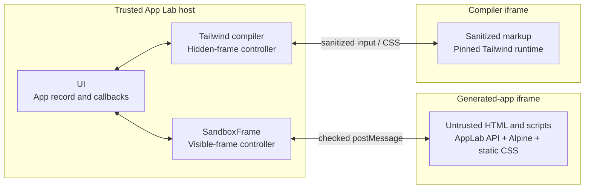

# Runtime

Runtime executes a generated HTML app without making its source part of the trusted App Lab host.

## Summary

- **Public boundary:** `SandboxFrame` and `compileAppStyles` from `src/runtime/index.ts`.
- **Owns:** sandbox documents, the `window.AppLab` bridge, console forwarding, and Tailwind compilation.
- **Security boundary:** generated code runs in an opaque-origin iframe and receives only host-selected capabilities.

## Why

A generated app needs scripts to be useful, but trusted execution would expose the host DOM, browser storage, other apps, sync
material, and provider credentials. Runtime uses sandboxed iframes to isolate that code, then restores only app-owned JSON access
through a checked `postMessage` bridge.

Alpine and precompiled Tailwind CSS keep each app convenient to author as one HTML document without widening the bridge.

## Model



`SandboxFrame` and `tailwindCompiler.ts` are trusted host controllers, not sandboxes themselves. Each creates and supervises a
separate `sandbox="allow-scripts"` iframe without `allow-same-origin`.

## Main Flows

### Run Stored Source

1. **`src/ui -> src/runtime`:** Supply an `AppRecord` and narrow data/console callbacks.
2. **`src/runtime`:** Create a random capability for this app load.
3. **`src/runtime`:** Parse the HTML as inert markup and replace any source-provided Content Security Policy.
4. **`src/runtime`:** Inject the capability, `window.AppLab`, Alpine, and previously compiled CSS.
5. **Generated-app iframe:** Run the resulting `srcdoc` with an opaque origin.

### Use The AppLab Bridge

| Generated-app operation | Host path |
| --- | --- |
| `AppLab.getData()` | `GET_MY_DATA` -> checked UI callback -> core -> `MY_DATA` response |
| `AppLab.saveData(data)` | `SAVE_MY_DATA` -> checked UI callback -> core -> optional sync |
| `AppLab.onDataChange(handler)` | accepted remote data -> UI -> `APP_LAB_DATA_CHANGED` |
| `console.*` or runtime error | `APP_LAB_CONSOLE` -> Console tool |

The iframe has origin `null`, so origin matching cannot identify it. `SandboxFrame` accepts a request only when `event.source` is
the mounted iframe window, the random load capability matches, and the message type is supported. The host supplies the active
app id; generated code cannot name another app.

### Compile Tailwind

1. **`src/ui -> src/runtime`:** Call `compileAppStyles` before saving app source.
2. **`src/runtime`:** Remove scripts, embeds, styles, metadata, and every attribute except `class` from compiler input.
3. **Compiler iframe:** Run the pinned `@tailwindcss/browser` package under a network-blocking CSP.
4. **`src/runtime`:** Accept CSS only from that iframe and compiler id.
5. **`src/runtime -> src/ui`:** Return the static CSS to be stored with the app record.
6. **`src/ui -> src/runtime`:** Rebuild the app with its stored CSS.
7. **`src/runtime -> generated-app iframe`:** Include the CSS in the generated `srcdoc`.

## Rules

- Generated and compiler frames may run scripts but never receive `allow-same-origin`.
- The host CSP blocks generated-app network access, remote frames, workers, forms, objects, and remote assets.
- Runtime receives callbacks, never `AppLabCore`, sync actions, provider configuration, or LLM credentials.
- Capabilities are scoped to one iframe load and revoked when that frame unloads or navigates unexpectedly.
- Alpine's `unsafe-eval` permission exists only inside the generated-app frame.
- Sharing source is trusted collaboration: sandboxing protects the host, not the behavior or app-owned data of the shared app.

See [Security](../SECURITY.md) for the complete trust model.

## Code Map

```text
src/runtime/
├── index.ts              Public exports
├── SandboxFrame.tsx      Visible generated-app iframe controller
├── sandboxDocument.ts    Restricted srcdoc and AppLab API
└── tailwindCompiler.ts   Isolated Tailwind compiler controller
```

## Verification

`SandboxFrame.test.tsx`, `sandboxDocument.test.ts`, and `tailwindCompiler.test.ts` cover bridge checks, CSP/runtime injection, and
Tailwind sanitization.

```bash
pnpm test
```
