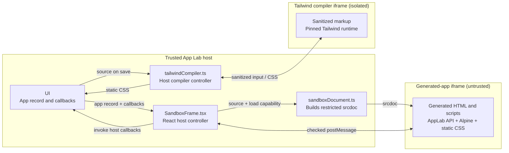

# Runtime

Runtime lets App Lab execute a generated app while continuing to treat its source as untrusted.

## Problem And Approach

A generated app is a complete HTML document containing markup, styles, and scripts. It must be allowed to execute before it can
be useful, but running it directly in the trusted React page would also give it access to App Lab's DOM, browser storage, other
apps, sync configuration, and future LLM credentials.

App Lab uses an **iframe** to separate those execution contexts. An iframe is a browser document embedded inside another page. Its
`sandbox` attribute lets the parent allow scripts while withholding same-origin access, so the generated app can control its own
document without being able to inspect the parent page or the host's storage.

That isolation removes access the app legitimately needs too. App Lab restores only selected capabilities through two browser
features:

1. The host injects a small `window.AppLab` API into the generated document.
2. That API and the host exchange structured messages with `postMessage`.

The generated app sees friendly methods such as `AppLab.getData()` and `AppLab.saveData()`. It never receives `AppLabCore`, an app
id chosen by its own code, or a reference to the React host. Trusted runtime code checks each internal message and invokes narrow
callbacks supplied by UI.

Runtime also keeps a generated app convenient to write as one HTML document. It injects Alpine for interactions and inserts
static Tailwind CSS compiled in a second isolated iframe. Neither library needs to run in the trusted host on behalf of generated
code.

## Execution Contexts

There are two sandboxed iframes, supervised by trusted code in `src/runtime`:



`SandboxFrame` is **not** the iframe. It is a trusted React component that creates and owns the visible generated-app iframe,
prepares its document, and handles its messages. Likewise, `tailwindCompiler.ts` is trusted host code that creates a separate,
short-lived compiler iframe.

## From Stored Source To A Running App

UI loads an `AppRecord` from core and gives it to `SandboxFrame` together with callbacks for loading data, saving data, reporting
console output, and handling remote updates. Runtime never imports or receives `AppLabCore` itself.

For each app load:

1. `SandboxFrame` creates a new random load capability.
2. `prepareSandboxDocument` parses the stored HTML as an inert document.
3. It replaces any source-provided Content Security Policy with App Lab's policy.
4. It injects the load capability, the `window.AppLab` implementation, Alpine, and previously compiled CSS.
5. `SandboxFrame` assigns the resulting HTML to the iframe's `srcdoc` property.
6. The browser creates an opaque-origin document and runs the generated scripts inside it.

The host-defined Content Security Policy blocks network connections, remote frames, workers, forms, objects, and remote assets.
The generated app can use inline scripts and styles inside its own document, but it cannot turn that permission into host access.

## The `window.AppLab` Bridge

`postMessage` lets separate browser windows exchange structured data even when the browser prevents them from directly reading
each other's JavaScript objects or DOM. The injected `window.AppLab` object uses it as a transport; generated app authors normally
use only the public methods and never deal with the internal message names.

| Generated-app API or event | Internal message | Host behavior |
| --- | --- | --- |
| `AppLab.getData()` | `GET_MY_DATA` | Call UI's data-loading callback for the active app and return `MY_DATA`. |
| `AppLab.saveData(data)` | `SAVE_MY_DATA` | Call UI's data-saving callback for the active app and return success or failure. |
| `AppLab.onDataChange(handler)` | `APP_LAB_DATA_HANDLER_STATUS` and `APP_LAB_DATA_CHANGED` | Register interest and deliver accepted remote data changes. |
| `console.*` and runtime errors | `APP_LAB_CONSOLE` | Forward formatted output to App Lab's Console tool. |

A data read follows this complete path:

```text
Generated app
  -> window.AppLab.getData()
  -> postMessage: GET_MY_DATA
  -> SandboxFrame checks the message
  -> UI callback receives the host-owned active app id
  -> AppLabCore.getAppData(appId)
  -> MY_DATA response travels back to the pending AppLab promise
```

The same separation applies to writes. UI's save callback persists app data through core first and then offers the change to
sync. A remote data update takes the opposite route: sync writes it to core, calls UI, and UI passes it to `SandboxFrame`, which
sends `APP_LAB_DATA_CHANGED` to registered generated-app handlers.

### Message Checks

The iframe has an opaque origin, so messages from it have origin `null`. Using `postMessage(..., "*")` is expected in this case;
the origin string cannot identify the sender. `SandboxFrame` instead accepts an app request only when:

1. `event.source` is the `Window` belonging to the currently mounted iframe.
2. The message contains the random capability created for the active load.
3. Its type is one of the supported bridge operations.

`event.source` answers **which browser window sent this message**. The capability answers **whether it belongs to the current
load of that window**. The capability is replaced on every rebuild and revoked when the frame unloads or navigates unexpectedly.

The generated app never supplies the app id used for persistence. `SandboxFrame` binds accepted requests to the app id captured
for the active load before it invokes UI. This prevents one generated app from naming another app's data.

## Alpine And Tailwind

Alpine is bundled with App Lab and injected into the generated-app iframe. It gives AI-generated HTML a compact way to express
state and interactions without introducing a per-app build. Alpine expressions require `unsafe-eval`, but that permission exists
only inside the opaque generated-app iframe. Runtime controls startup so app scripts can register Alpine components first.

Tailwind needs a compilation step. When source is created or saved, UI calls `compileAppStyles` before it writes the `AppRecord`
to core:

1. Runtime parses the source and detects whether Tailwind is enabled.
2. It removes scripts, frames, embeds, links, metadata, styles, and all attributes except `class` from the compiler markup.
3. It sends sanitized markup and extracted class candidates to a hidden `sandbox="allow-scripts"` iframe.
4. The pinned `@tailwindcss/browser` package runs inside that iframe with a network-blocking Content Security Policy.
5. Runtime accepts CSS only from that exact iframe and compiler id, then returns it to UI.
6. UI persists the static CSS beside the app source in core; the visible app iframe receives that CSS on its next build.

Compiling in a second sandbox means the host never has to execute generated scripts to discover styles. The resulting CSS is
still governed by the visible app iframe's Content Security Policy, so it cannot load remote images, fonts, or other resources.

## How The Pieces Solve The Problem

The original problem has two competing requirements: generated source must run, and it must not become trusted host code. The
browser's sandboxed iframe provides that separation. The host-defined Content Security Policy narrows what code inside the
sandbox can reach.

Isolation alone would leave generated apps unable to persist useful state. The checked `window.AppLab` message bridge restores
only app-owned JSON operations, with the app id selected by the host. Alpine and static compiled Tailwind CSS restore a productive
one-document authoring environment without widening that bridge.

The result is that generated code can control its own DOM and app data, while the React host retains control of app identity,
IndexedDB, sync, provider configuration, and future LLM keys. Runtime itself remains independent of core and sync because UI
supplies the only callbacks it can invoke.

This boundary does not make a shared app's behavior trustworthy. Anyone who can edit its source can change what it displays and
how it uses that app's own data. Sharing source is therefore trusted collaboration even though the surrounding workspace remains
isolated.

## Code Map

```text
src/runtime/
├── index.ts              Public exports used by UI
├── SandboxFrame.tsx      Trusted React controller for the generated-app iframe
├── sandboxDocument.ts    Builds the generated iframe's restricted srcdoc and AppLab API
└── tailwindCompiler.ts   Trusted controller for the isolated Tailwind compiler iframe
```

## Verification

`SandboxFrame.test.tsx`, `sandboxDocument.test.ts`, and `tailwindCompiler.test.ts` cover bridge lifecycle checks, Content Security
Policy and runtime injection, Tailwind marker detection, and class-candidate extraction. Run them with the normal suite:

```bash
pnpm test
```

The canonical trust model and secret inventory are in [Security](../SECURITY.md).
