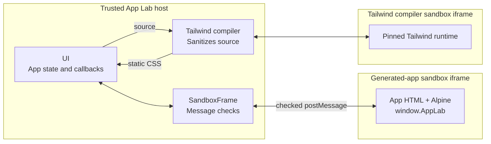

# Runtime

Runtime is the boundary between a generated app and the trusted App Lab host around it.

## Why Runtime Exists

Generated source must execute before it can become an interactive app. Running that source directly inside the App Lab page
would also give it access to the host's running code and browser storage. That could expose other apps, workspace data,
storage-provider setup, and future LLM keys to code produced by an AI tool or supplied by a collaborator.

Runtime prevents that by running each generated app in an isolated sandbox iframe. The app may control its own document and data,
but it cannot reach the host or the rest of the workspace.

Isolation creates two further needs. The app requires a narrow, controlled way to save its own data, and it needs a useful
execution environment without becoming a separate software project. Runtime therefore provides the `window.AppLab` bridge and
keeps each app as one complete HTML document. It includes Alpine for state and interactions, while Tailwind gives AI tools a
broad styling vocabulary that App Lab compiles without a per-app toolchain or external CDN.

These needs shape the module below: isolate generated code, expose only deliberate host capabilities, and provide a consistent
environment for running self-contained apps.

Start with the [developer map](./README.md) for the relationship between UI, runtime, and core. The canonical threat model remains
in [Security](../SECURITY.md).

## Map

```text
src/runtime/
├── index.ts              Exposes the public runtime contract
├── SandboxFrame.tsx      Isolates the app and checks bridge messages
├── sandboxDocument.ts    Builds the restricted, self-contained app environment
└── tailwindCompiler.ts   Produces styles without executing generated code
```



The visible generated-app sandbox iframe answers the primary isolation need. `SandboxFrame` gives it the narrow data path;
`sandboxDocument` supplies the controlled one-document environment. The hidden Tailwind compiler sandbox iframe receives a
sanitized copy of the app's markup and returns only CSS, preserving that environment without moving generated code into the host.

## `SandboxFrame.tsx`

`SandboxFrame` solves both isolation and controlled data access. The app iframe uses `sandbox="allow-scripts"` without
`allow-same-origin`. The browser therefore gives it an opaque origin: its scripts can run inside the app document but cannot read
the parent DOM, App Lab's browser storage, or JavaScript objects holding provider configuration.

Every app load receives a new random capability. For a message from the app to be handled, `SandboxFrame` requires:

1. `event.source` is the currently mounted iframe window.
2. The message carries the capability for the active load.
3. The message type is one of the small supported bridge operations.

The generated app never supplies the app id used for persistence. The host binds accepted `GET_MY_DATA` and `SAVE_MY_DATA`
requests to the active load's app id before calling UI-provided callbacks. This is what prevents one app from naming and reading
another app's data.

The capability is replaced on every rebuild and revoked when the frame unloads or navigates unexpectedly. Because a sandboxed
`srcdoc` frame has an opaque origin, its origin is `null`; using `postMessage(..., "*")` is expected here. Authentication comes
from the exact source-window and per-load capability checks, not from an origin string.

## `sandboxDocument.ts`

An isolated iframe still needs to become a useful app environment. Before source enters the frame, `sandboxDocument` constructs
that environment without relaxing the boundary:

- A host-defined Content Security Policy replaces any policy supplied in generated source.
- Network connections, remote frames, workers, forms, objects, and remote assets are blocked.
- The narrow `window.AppLab` API is injected before generated scripts.
- A pinned Alpine runtime is injected into the sandbox, never into the host page.
- Host-compiled CSS is inserted as static inline CSS.

The bridge exposes `getData`, `saveData`, `onDataChange`, and `onError`. It also forwards the app's console output to App Lab.
Unknown messages do not gain host behavior.

Alpine expressions require `unsafe-eval`, but that permission exists only in the opaque generated-app iframe. Runtime controls
Alpine startup so generated source can register components before Alpine initializes the document.

## `tailwindCompiler.ts`

Tailwind provides the styling part of the one-document workflow, but compiling generated markup in the host would weaken the
isolation goal. `compileAppStyles` therefore follows this path:

1. Parse the source as inert HTML and detect the App Lab Tailwind marker.
2. Remove scripts, frames, embeds, links, metadata, styles, and every attribute except `class` from compiler markup.
3. Send that markup and extracted class candidates to a hidden `sandbox="allow-scripts"` iframe with a network-blocking CSP.
4. Run the pinned `@tailwindcss/browser` package inside that compiler iframe.
5. Accept a result only from that iframe with its random compiler id, then persist the returned static CSS with the app source.

Generated Tailwind CSS is still subject to the visible app sandbox's CSP, so a class cannot turn into a route for loading remote
images, fonts, or other resources.

## Boundary Summary

The implementation maps back to the original needs:

| Need | Mechanism | Result |
| --- | --- | --- |
| Run generated source without trusting it | Opaque iframe, host-defined CSP, and a separate compiler sandbox | Generated code cannot access host DOM, browser storage, provider setup, LLM keys, or network APIs. |
| Let an app persist its own data | Checked source window, per-load capability, and host-bound app id | The app can use `window.AppLab`, but it cannot choose another app's data. |
| Keep apps self-contained and AI-friendly | Host-injected Alpine and static compiled Tailwind CSS | One HTML document can provide interactions and styling without a per-app build or trusted host execution. |
| Keep runtime independent | Values and callbacks supplied by UI | Runtime has no direct dependency on core, sync, or UI internals. |

Anyone who can edit a shared app's source can still change what that app displays and how it uses that app's own data. Sharing
source is therefore trusted collaboration, even though the host and the rest of the workspace remain isolated.

## Verification

`SandboxFrame.test.tsx`, `sandboxDocument.test.ts`, and `tailwindCompiler.test.ts` cover bridge lifecycle checks, CSP and runtime
injection, Tailwind marker detection, and class-candidate extraction. Run them with the normal suite:

```bash
pnpm test
```
