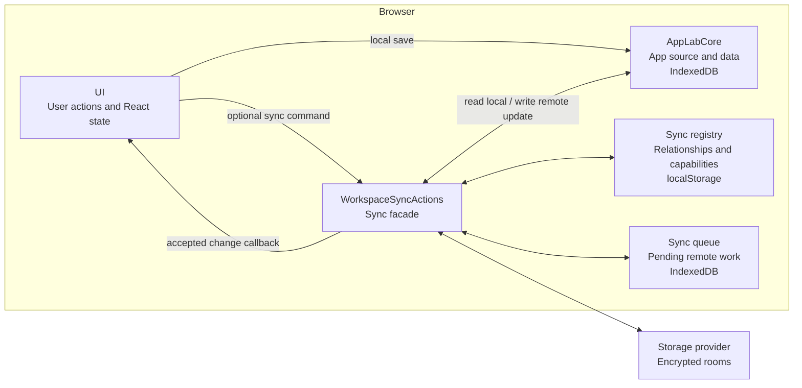

# Sync

Sync adds encrypted backup, sharing, and cross-device updates without replacing App Lab's local workspace.

## Problem And Approach

Core already stores each app's complete source, metadata, compiled CSS, and JSON data in the browser. That is enough to create,
open, and edit apps offline, but a local IndexedDB database cannot by itself restore the workspace on another device or exchange
updates with a friend.

Sync is therefore a companion to core rather than a second source of truth. It adds:

1. **Remote rooms** that mirror app content and workspace relationships as encrypted payloads.
2. **Local sync metadata** that remembers which local app maps to which remote rooms.
3. **A durable queue** that lets local saves finish while remote work waits for connectivity.
4. **Provider adapters** that translate the room model to a remote service such as Firebase Realtime Database.

The division preserves the local-first rule: the browser copy in core remains usable on its own, and remote behavior is activated
only when an app has a sync relationship.

## Architecture At A Glance

`App.tsx` creates one core object and injects that same object into sync before passing both contracts to UI:

```text
core = createIndexedDbCore()
syncActions = createBrowserWorkspaceSyncActions(core)
WorkspaceShell(core, syncActions)
```

That construction explains why both of these statements are true:

- UI calls core directly when a user creates, edits, or deletes local app state.
- Sync also calls core to read current state for an upload and to persist an accepted remote update.



`WorkspaceSyncActions` is the facade around the registry, queue, rooms, and provider. Production code outside `src/sync` does not
import those details directly.

## State Ownership

Sync becomes easier to reason about when its state is separated by owner:

| Owner | Location | Contains |
| --- | --- | --- |
| Core | IndexedDB `app-lab-v2` | Local app records and app-owned JSON data. |
| Sync registry | `localStorage` key `app-lab-workspace-sync-v1` | Storage profile, workspace id, manifest capability, per-app room relationships, observed versions, and tombstones. |
| Sync queue | IndexedDB `app-lab-sync-queue-v1` | Pending room creation, source/data writes, remote deletion, and workspace-manifest writes. |
| Storage provider | Remote room records | Encrypted payloads, versions, timestamps, and access-token hashes. |

Core's IndexedDB database is durable product state. The queue's separate IndexedDB database is durable transport state: it may be
deleted after its work succeeds without deleting an app. The sync registry is relationship state; it explains how local records
connect to remote records but does not contain the canonical app source or app data.

## Remote Rooms

The remote model mirrors the two kinds of state described above:

```text
Remote sync state
├── One workspace-manifest room per synced workspace
│   ├── Sync registry information needed to reconstruct the workspace
│   └── References to each app's room relationship
└── One room pair for each synced app
    ├── One app-package room
    │   └── App metadata, complete HTML source, and compiled CSS
    └── One app-data room
        └── JSON saved by the generated app
```

Owned app rooms use the workspace's configured provider. Joined app records can instead point to the owner's provider carried in
the invite.

The app-package and app-data rooms map to records owned locally by core. They are separate because a source update rebuilds the
runtime iframe, while an app-data update can be delivered live through `AppLab.onDataChange`.

The workspace-manifest room maps to the **sync registry**, not to a core record. It contains the workspace identity, storage
profile, per-app room relationships, observed versions, and deletion tombstones. Core is not involved in creating or merging this
manifest. Sync owns it, but uses the resulting relationships to decide which app rooms should be loaded into or removed from core.

Each room has a local `RoomCapability`: the room id, decryption secret, access material, and last observed version. Payloads are
encrypted in the browser. The provider can store and version them without receiving plaintext app content or room decryption
secrets.

## How Changes Move

The architecture above describes the participants. To follow a concrete sync flow, ask two questions:

1. **What changed?** An app package, app data, or the workspace manifest.
2. **Which direction is it moving?** From this browser to a room, or from a room into this browser.

| Payload | Local to remote | Remote to local |
| --- | --- | --- |
| App package | Source save -> core -> queue -> `app-package` room | Room subscription -> core -> active iframe rebuild |
| App data | `AppLab.saveData` -> core -> queue -> `app-data` room | Room subscription -> core -> `AppLab.onDataChange` |
| Workspace manifest | Relationship change -> queue -> `workspace-manifest` room | Manifest merge -> hydrate/delete core apps -> launcher refresh |

App Lab uses explicit commands and callbacks for these paths. IndexedDB is persistence, not a global event bus, so the origin of a
write remains visible.

### App Package

**Use case:** A user edits an app's HTML source on browser A and browser B should run the new version.

**Local to remote:** UI first compiles any Tailwind styles and saves the complete `AppRecord` through core. It then calls
`pushAppSource`. Sync creates the app's room relationship when needed, adds a source operation to the durable queue, and starts a
worker. The worker reads the current record from core, encrypts the app package, writes it to the source room, and records the
accepted version.

**Remote to local:** Browser B's source-room subscription receives a newer snapshot. If no unsent local source should take
priority, sync decrypts the package and writes it through `AppLabCore.upsertApp`. It then calls UI with the updated record. React
passes that record to runtime, which rebuilds the generated-app iframe.

The synchronized unit is the whole app package: metadata, complete HTML source, and compiled CSS. There is no line-level source
protocol hidden underneath it.

### App Data

**Use case:** A generated app saves JSON on browser A and an open copy on browser B should reflect the new value live.

**Local to remote:** The generated app calls `AppLab.saveData`. Runtime passes the request to UI, which saves the JSON through
core and then calls `pushAppData`. Sync queues the latest data snapshot, encrypts it, and writes it to the app-data room.

**Remote to local:** Browser B's data-room subscription checks and decrypts the newer snapshot, saves it through core, and calls
UI. UI passes the change through runtime to the generated app's `AppLab.onDataChange` handlers. If the app has not registered a
handler, App Lab keeps the data in core and tells the user to reopen the app to load it.

Source and data use separate rooms because this live data path should not rebuild the iframe.

### Workspace Manifest

**Use case:** A user creates or deletes an app on browser A and browser B's launcher should show the same workspace structure.

**Local to remote:** Changes to app-room relationships, observed versions, or tombstones update the sync registry. Sync queues a
manifest save, merges with a newer remote manifest when necessary, encrypts the result, and writes it to the workspace-manifest
room. Core is not involved because the manifest describes sync relationships rather than app content.

**Remote to local:** Browser B's manifest subscription merges records by app id. Sync loads newly referenced app-package and
app-data rooms into core, removes apps covered by owner-deletion tombstones, and calls UI to refresh the launcher.

## Establishing A Sync Relationship

The flows above assume sync knows which provider and rooms belong to an app. That relationship enters the browser in one of three
ways: configuring the user's own storage, importing an app invite, or restoring workspace sync material.

### Configure A Storage Provider

Saving a storage profile records the provider connection in the sync registry. App Lab then scans the current apps in core,
creates an **owned** source/data room pair for each one, uploads their current package and data, and creates the workspace-manifest
room.

Edits made before this setup are not retained as a queue history. Local-only saves went only to core; setup backs up the latest
state that core contains at that moment.

### Import A Shared App

An invite carries the owner's provider reference and capabilities for one app's source and data rooms. Previewing the invite
claims source-room membership and decrypts enough metadata for the confirmation dialog, but does not write the app into core.

Importing claims both rooms, loads their content into core, and records a **joined** relationship. The app remains connected to
the owner's provider, so the recipient does not need to configure a storage project of their own. A **private copy** instead gets
new rooms owned by the recipient's workspace.

### Restore A Workspace

Another browser needs more than the same provider configuration: it must know the workspace-manifest room and possess its
decryption capability. **Workspace sync material** contains that capability, the provider reference, owner setup material, and an
embedded point-in-time manifest.

During restore, sync loads and merges the manifest, loads its referenced app rooms into core, and saves the reconstructed sync
registry. Decryption secrets cannot be recovered from the provider alone.

### Without A Current Storage Profile

On a fresh local-only workspace, the sync facade still runs but owned apps have no room relationships. Source and data saves do
not enter the durable queue, and no provider connection is opened.

Sync metadata can outlive a configuration. For example, after a user configures Firebase and backs up apps, selecting **Remove
profile** clears the connection but retains per-app room relationships and pending queue records. Owned-app sync remains paused
until the profile is configured or restored again. Joined apps can continue using the provider references in their invites.

## Reliability Rules

### Durable Queue

Once an app has a sync relationship, queue records let local saves complete while its provider is offline. Workers later retry
room creation, source/data writes, deletion, and manifest writes. Repeated source or data saves are coalesced so reconnecting sends
the latest relevant state rather than every intermediate edit. Interrupted `syncing` items return to `pending` at startup.

### Conflict Policy

Pending local source or data work acts as a barrier: sync will not accept a remote snapshot that would discard the unsent local
change. Beyond that, the MVP policy follows the payload taxonomy:

- **App package:** The complete HTML document is one change; there is no line or CRDT merge.
- **App data:** A reconnecting browser's pending JSON snapshot can overwrite a newer remote snapshot.
- **Workspace manifest:** Records merge by app id, highest observed room versions survive, and deletion tombstones prevent stale
  resurrection.

These policies differ because source, arbitrary app-owned JSON, and workspace relationships have different semantics.

### Deletion

- Deleting a local-only app removes its source and data from core.
- Deleting an owned synced app also queues remote room deletion and a workspace tombstone.
- Deleting a joined app removes only this browser's local app and relationship; the owner's rooms remain.

## Security Boundaries

Sync crosses several trust boundaries, and each layer protects something different.

### Generated Apps And The Host

Generated apps receive only runtime's `window.AppLab` API. They never receive the storage profile, sync registry, queue,
`RoomCapability` objects, invites, or workspace sync material. Runtime binds data requests to the active app id, so generated code
cannot choose another app or reach sync directly.

### Browser And Storage Provider

Room payloads are encrypted in the browser with AES-GCM and a separate 256-bit decryption secret for each room. The room id, type,
and version are authenticated with the ciphertext. The remote service does not receive the room decryption secrets. Current
Firebase records contain encrypted payloads, versions, timestamps, and access-token hashes.

`RealtimeSyncProvider` is the room-level contract implemented by provider adapters. Firebase Realtime Database is the current
production adapter. It uses Anonymous Authentication and generated database rules to restrict rooms to the owner and members who
claimed an invite. Tests can use the in-memory provider when a real access boundary is unnecessary.

### Owners And Collaborators

A room capability is authority to decrypt and use that room. App Lab's normal client also checks access-token hashes and
optimistic versions, but those client checks cannot make an authorized member's modified provider client read-only.

An app invite carries full read/write capabilities for one app's two rooms. Workspace sync material is more powerful: it restores
the manifest and contains owner setup material. Both are sensitive bearer material and must be kept private. The MVP does not yet
provide read-only invites, revocation, or key rotation.

The complete public threat model and secret inventory are in [Security](../SECURITY.md).

## Code Map

```text
src/sync/
├── index.ts                 Public contract and browser composition
├── workspaceSyncActions.ts  Facade coordinating complete sync workflows
├── workspace/               Local sync registry, remote manifest, and recovery
├── rooms/                   Encrypted room formats and app-room operations
├── queue/                   Durable outgoing work and queue workers
├── providers/               Storage-provider adapters and configuration
├── sharing/                 Invite encoding and parsing
└── testing/                 Reusable in-memory test support
```

## Verification

```bash
pnpm test
pnpm test:firebase-smoke
pnpm test:firebase-e2e
```

Unit tests cover provider-neutral sync policy with memory stores. The current real-provider suites use Firebase to cover access
rules, offline queue recovery, live updates, deletion, workspace recovery, offline additions, and stale-browser tombstones.
