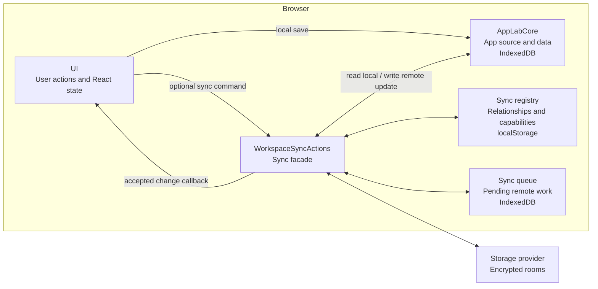

# Sync

Sync adds encrypted backup, sharing, and cross-device updates without replacing App Lab's local workspace.

## Problem And Approach

Core already stores each app's complete source, metadata, compiled CSS, and JSON data in the browser. That is enough to create,
open, and edit apps offline, but a local IndexedDB database cannot by itself restore the workspace on another device or exchange
updates with a friend.

Sync is therefore a companion to core rather than a second source of truth. It adds:

1. **Remote rooms** that mirror app content and workspace relationships as encrypted payloads.
2. **Local sync metadata** that remembers which local app maps to which remote rooms.
3. **A durable queue** that lets local saves finish while remote work waits for connectivity.
4. **Provider adapters** that translate the room model to a remote service such as Firebase Realtime Database.

The division preserves the local-first rule: the browser copy in core remains usable on its own, and remote behavior is activated
only when an app has a sync relationship.

## Architecture At A Glance

`App.tsx` creates one core object and injects that same object into sync before passing both contracts to UI:

```text
core = createIndexedDbCore()
syncActions = createBrowserWorkspaceSyncActions(core)
WorkspaceShell(core, syncActions)
```

That construction explains why both of these statements are true:

- UI calls core directly when a user creates, edits, or deletes local app state.
- Sync also calls core to read current state for an upload and to persist an accepted remote update.



`WorkspaceSyncActions` is the facade around the registry, queue, rooms, and provider. Production code outside `src/sync` does not
import those details directly.

## State Ownership

Sync becomes easier to reason about when its state is separated by owner:

| Owner | Location | Contains |
| --- | --- | --- |
| Core | IndexedDB `app-lab-v2` | Local app records and app-owned JSON data. |
| Sync registry | `localStorage` key `app-lab-workspace-sync-v1` | Storage profile, workspace id, manifest capability, per-app room relationships, observed versions, and tombstones. |
| Sync queue | IndexedDB `app-lab-sync-queue-v1` | Pending room creation, source/data writes, remote deletion, and workspace-manifest writes. |
| Storage provider | Remote room records | Encrypted payloads, versions, timestamps, and access-token hashes. |

Core's IndexedDB database is durable product state. The queue's separate IndexedDB database is durable transport state: it may be
deleted after its work succeeds without deleting an app. The sync registry is relationship state; it explains how local records
connect to remote records but does not contain the canonical app source or app data.

## Remote Rooms

The remote model mirrors the two kinds of state described above:

```text
Remote sync state
├── One workspace-manifest room per synced workspace
│   ├── Sync registry information needed to reconstruct the workspace
│   └── References to each app's room relationship
└── One room pair for each synced app
    ├── One app-package room
    │   └── App metadata, complete HTML source, and compiled CSS
    └── One app-data room
        └── JSON saved by the generated app
```

Owned app rooms use the workspace's configured provider. Joined app records can instead point to the owner's provider carried in
the invite.

The app-package and app-data rooms map to records owned locally by core. They are separate because a source update rebuilds the
runtime iframe, while an app-data update can be delivered live through `AppLab.onDataChange`.

The workspace-manifest room maps to the **sync registry**, not to a core record. It contains the workspace identity, storage
profile, per-app room relationships, observed versions, and deletion tombstones. Core is not involved in creating or merging this
manifest. Sync owns it, but uses the resulting relationships to decide which app rooms should be loaded into or removed from core.

Each room has a local `RoomCapability`: the room id, decryption secret, access material, and last observed version. Payloads are
encrypted in the browser. The provider can store and version them without receiving plaintext app content or room decryption
secrets.

## How Changes Move

App Lab uses explicit commands and callbacks. IndexedDB is persistence, not a global event bus.

### Local Change

When a user saves source or a generated app saves data:

1. UI writes the change through `AppLabCore`.
2. After local success, UI calls `WorkspaceSyncActions.pushAppSource` or `pushAppData`.
3. Sync finds or creates the app's local room relationship and records pending work in the sync queue.
4. A queue worker encrypts the payload and writes it through the configured provider.
5. Sync records the accepted room version and queues an updated workspace manifest.

The local save does not depend on step 4 succeeding. If the browser or provider is offline, the queue survives the reload and a
later wake-up retries it. Repeated source or data saves are coalesced so the latest relevant state is sent instead of every
intermediate edit.

### Remote App Change

For the active app, sync subscribes to its source and data rooms:

1. The provider reports a newer encrypted snapshot.
2. Sync checks its version and whether unsent local work should take priority.
3. Sync decrypts the accepted snapshot and writes it through the same `AppLabCore` object used by UI.
4. Sync records the version and calls UI.
5. UI either rebuilds the runtime with the new source or forwards new data to `AppLab.onDataChange`.

Because the incoming write remains inside the sync flow, it is not observed as a new user edit and sent back to the provider.

### Remote Workspace Change

Sync also subscribes to the workspace-manifest room. A newer manifest is merged by app id. Sync then loads newly referenced app
rooms into core, applies owner-deletion tombstones, and tells UI to refresh the launcher. This is how an app created on one synced
browser appears on another.

## When No Storage Profile Is Configured

The sync facade still exists, which lets UI use one set of code paths, but owned apps remain local-only. No owned app rooms or
workspace-manifest room are created until a storage profile is configured.

A joined app is the exception. Its invite contains the owner's provider reference and the capabilities for that app's source and
data rooms, so the recipient can continue syncing that shared app without configuring a storage project of their own.

Sync metadata can also outlive a configuration. For example, a user can configure Firebase, back up apps, and later select
**Remove profile**. That clears the provider connection but leaves the browser's per-app room relationships and pending
queue records intact. Owned-app sync cannot resume until the profile is configured or restored again; joined apps still carry
their provider references from their invites.

## Workspace Recovery

Another browser needs more than the same provider configuration: it must know the workspace-manifest room and possess its
decryption capability. **Workspace sync material** packages that capability, the provider reference, owner setup material, and an
embedded point-in-time manifest.

During restore, sync loads and merges the workspace manifest, loads the referenced app rooms into core, and saves the
reconstructed sync registry. Decryption secrets are not recoverable from the storage provider alone.

## Sharing And App Relationships

Sharing should connect a recipient to one app without exposing the owner's whole workspace. An invite therefore contains the
provider reference and capabilities for only that app's source and data rooms. It is sensitive full-access bearer material:
recipients can read and update both rooms.

- **Owned app:** Uses rooms created through this workspace's storage profile.
- **Joined app:** Remains connected to the owner's provider and rooms from the invite.
- **Private copy:** Uses new rooms owned by this workspace while retaining origin metadata.

Previewing an invite does not import the app into core, but it does claim source-room membership so App Lab can decrypt the
confirmation details. Importing then loads both app rooms into core and records the joined relationship in the sync registry.

Deleting a joined app removes only this browser's local app and relationship. Deleting an owned app queues remote room deletion
and adds a workspace tombstone so another browser cannot restore the stale app.

## Conflict Policy

Pending local source or data work acts as a barrier: sync will not accept a remote snapshot that would discard the unsent local
change. Beyond that, the MVP policy matches each payload:

- **App source:** The complete HTML document is one change; there is no line or CRDT merge.
- **App data:** A reconnecting browser's pending JSON snapshot can overwrite a newer remote snapshot.
- **Workspace manifest:** Records merge by app id, highest observed room versions survive, and deletion tombstones prevent stale
  resurrection.

These policies differ because source, arbitrary app-owned JSON, and workspace relationships have different semantics.

## Provider Boundary

`RealtimeSyncProvider` is the room-level contract implemented by storage-provider adapters. Firebase Realtime Database is the
current production adapter; tests use an in-memory implementation where a real provider is unnecessary.

Each adapter owns its connection and access model. The Firebase adapter uses Anonymous Authentication and generated database
rules to restrict rooms to owners and members who claimed an invite. App Lab additionally checks token hashes and optimistic
versions in its normal client. Those client checks cannot make an authorized member's deliberately modified provider client
read-only.

The complete trust model and secret inventory are in [Security](../SECURITY.md).

## Code Map

```text
src/sync/
├── index.ts                 Public contract and browser composition
├── workspaceSyncActions.ts  Facade coordinating complete sync workflows
├── workspace/               Local sync registry, remote manifest, and recovery
├── rooms/                   Encrypted room formats and app-room operations
├── queue/                   Durable outgoing work and queue workers
├── providers/               Storage-provider adapters and configuration
├── sharing/                 Invite encoding and parsing
└── testing/                 Reusable in-memory test support
```

## Verification

```bash
pnpm test
pnpm test:firebase-smoke
pnpm test:firebase-e2e
```

Unit tests cover provider-neutral sync policy with memory stores. The current real-provider suites use Firebase to cover access
rules, offline queue recovery, live updates, deletion, workspace recovery, offline additions, and stale-browser tombstones.
