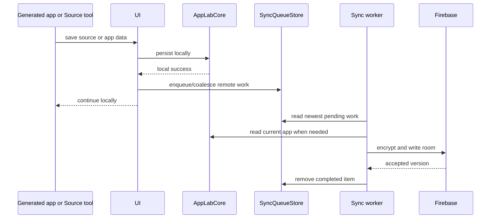

# Sync Design

Sync extends App Lab's local workspace. It does not replace it: `AppLabCore` remains the local source of truth, while `src/sync`
owns the work needed to back up, share, and reconcile that state through Firebase.

This page explains the rules that are difficult to infer from individual files. Start with the
[developer map](./README.md) for the surrounding modules and vocabulary.

## Boundary

UI uses the public `WorkspaceSyncActions` facade from `src/sync/index.ts`. The browser factory receives the same `AppLabCore`
instance used by UI and supplies the browser implementations of `SyncQueueStore` and `WorkspaceSyncRegistry`.

Generated apps stay outside this boundary:

```text
Generated app -> window.AppLab -> runtime -> UI callback -> core -> sync
```

They never receive a `StorageProfile`, `RoomCapability`, `AppInvitePayload`, Firebase client, or encryption key.

## State Model

Sync coordinates three kinds of local state:

| State | Contract | Purpose |
| --- | --- | --- |
| Apps and app data | `AppLabCore` | The local source of truth in IndexedDB. |
| Workspace sync metadata | `WorkspaceSyncRegistry` | Storage profile, workspace identity, app relationships, room capabilities, versions, and tombstones. |
| Pending remote work | `SyncQueueStore` | Durable IndexedDB queue for work that must survive reloads and offline periods. |

The queue separates local success from remote availability. A source or data save can complete locally while Firebase is offline;
the corresponding worker retries the newest queued state later. Abandoned `syncing` items return to `pending` when sync starts
again.

## Remote Rooms

`RealtimeSyncProvider` presents one provider-neutral room abstraction. Firebase Realtime Database is the current adapter.

| `RoomType` | Common name | Encrypted payload |
| --- | --- | --- |
| `workspace-manifest` | Workspace manifest room | Workspace relationships, room references, versions, and tombstones. |
| `app-package` | Source room | App metadata, complete HTML source, and derived compiled CSS. |
| `app-data` | App-data room | Generated-app JSON data. |

A `RoomCapability` combines the room id with its decrypt secret, access material, and last-seen remote version. Firebase stores
token hashes, versions, timestamps, and encrypted payloads; it must not store decrypt secrets or raw access tokens.

Source and data use separate rooms because they have different update behavior. A source change replaces executable code and
reloads the active sandbox. An app-data change can be delivered live through `AppLab.onDataChange`.

## App Relationships

`AppSyncRecord` deliberately distinguishes where an app belongs:

| Record | UI relationship | Routing rule |
| --- | --- | --- |
| `OwnedAppSyncRecord` with a private share state | Private | Back up through this workspace's storage profile. |
| `OwnedAppSyncRecord` with an invite created | Shared by me | Use the same stable rooms and allow an invite to be forwarded. |
| `JoinedAppSyncRecord` | Shared with me | Stay attached to the provider and rooms contained in the invite. |
| `PrivateCopySyncRecord` | Private copy | Use new rooms owned by this workspace while retaining origin metadata. |

A joined app is not silently copied into the recipient's Firebase project. This is a product routing rule, not proof of ownership:
current invite links grant full access to the shared source and app-data rooms.

Relationship and health are separate. `AppSyncBadge` describes where an app belongs; `PendingSyncOperation` and provider
connectivity describe whether its remote copy is currently clean, pending, syncing, offline, or in need of attention.

## Outgoing Changes

The UI coordinates local persistence and sync explicitly. IndexedDB is not used as an event bus.



Explicit commands preserve the origin of a write and avoid remote updates being observed as new local edits. Queue entries also
coalesce repeated source and app-data saves so a reconnect sends the latest relevant state rather than every intermediate edit.

## Incoming Changes

`WorkspaceSyncActions` subscribes to the workspace manifest and to the active app's source and app-data rooms.

- A newer source snapshot is decrypted, written through `AppLabCore.upsertApp`, recorded in `WorkspaceSyncRegistry`, and returned
  through a UI callback. UI updates the active `AppRecord`, causing runtime to rebuild the sandbox document.
- A newer app-data snapshot is decrypted and written through `AppLabCore.saveAppData`. UI then passes a remote-data event to the
  runtime; generated apps can handle it with `AppLab.onDataChange`.
- A newer workspace manifest is merged with local workspace metadata. UI refreshes the launcher and hydrates app rooms that are
  new to this browser.

Pending local source or data work acts as a barrier where accepting a remote snapshot would discard a local edit.

## Conflict Policy

App Lab does not pretend arbitrary generated-app JSON has a universal merge strategy.

**App data:** latest local pending data wins. If one browser edits offline while another writes online, the reconnecting browser's
pending JSON snapshot may overwrite the newer remote snapshot. This is an accepted MVP limitation.

**Source:** the complete HTML document is the unit of change. Source collaboration is trusted collaboration; there is no line or
CRDT merge.

**Workspace manifest:** records merge by app id. Apps independently added on offline and online devices are retained, room
capabilities keep their highest observed versions, and tombstones suppress stale app records. This avoids resurrecting a deleted
app when an offline browser later adds a different app.

These policies are intentionally different because the payloads mean different things. A future chat room can use message-id
union semantics without forcing that policy onto arbitrary app data.

## Deletion

- Deleting a local-only app removes its local source and data.
- Deleting an owned synced app removes it locally, queues remote deletion, writes a deleted marker to the source room, and removes
  the app-data room. Collaborators retain a visible `Deleted by owner` state rather than silently losing their local record.
- Deleting a joined app removes only this browser's local app and joined metadata. The owner's rooms and other collaborators are
  unaffected.

Workspace tombstones prevent another synced browser with stale metadata from restoring a deleted owned app.

## Workspace Sync Material

The UI calls the exported text **workspace sync material**. In code it is represented by `WorkspaceRecoveryMaterial` because it can
restore the workspace into a clean browser.

It contains the provider reference, workspace manifest capability, an embedded point-in-time manifest, and owner setup material.
That makes it more powerful than an app invite. Adding the same Firebase configuration on another device is not sufficient: the
new browser also needs this material to locate and decrypt the workspace manifest.

If local browser storage is erased and no workspace sync material was saved, Firebase access alone should not decrypt the
workspace. Keeping decrypt secrets out of Firebase is part of the client-side encryption model.

## Firebase Access Boundary

The current `auth-v1` setup uses Firebase Anonymous Authentication and generated Realtime Database rules:

- the owner can create rooms and claim-token records
- an invite recipient can claim membership only for room ids contained in the invite
- reading or writing an existing room requires owner status or membership for that room

App Lab's normal client also checks room token hashes and optimistic versions. The Firebase rules do not enforce those client-side
checks against a modified Firebase client once that client is a room member. App invites are therefore sensitive, full-access
bearer material rather than read-only links.

Previewing an invite does not import or save the app locally. It does claim membership for the source room so App Lab can load and
decrypt the metadata shown in the confirmation dialog.

The canonical public trust model and secret inventory live in [Security](../SECURITY.md).

## Verification

Pure sync behavior is covered with memory stores and providers; Firebase behavior is also tested against a real configured test
project:

```bash
pnpm test
pnpm test:firebase-smoke
pnpm test:firebase-e2e
```

The real-provider suites cover RTDB rules, offline queue recovery, repeated live updates, owner deletion, workspace recovery,
offline additions, and stale-browser tombstones.
