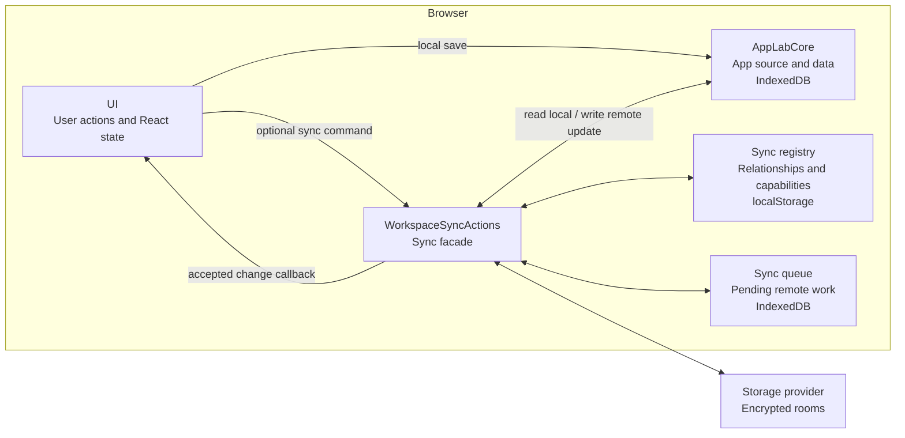

# Sync

Sync adds encrypted backup, sharing, and cross-device updates without replacing App Lab's local workspace.

## Problem And Approach

Core already stores each app's complete source, metadata, compiled CSS, and JSON data in the browser. That is enough to create,
open, and edit apps offline, but a local IndexedDB database cannot by itself restore the workspace on another device or exchange
updates with a friend.

Sync is therefore a companion to core rather than a second source of truth. It adds:

1. **Remote rooms** that mirror app content and workspace relationships as encrypted payloads.
2. **Local sync metadata** that remembers which local app maps to which remote rooms.
3. **A durable queue** that lets local saves finish while remote work waits for connectivity.
4. **Provider adapters** that translate the room model to a remote service such as Firebase Realtime Database.

The division preserves the local-first rule: the browser copy in core remains usable on its own, and remote behavior is activated
only when an app has a sync relationship.

## Architecture At A Glance

`App.tsx` creates one core object and injects that same object into sync before passing both contracts to UI:

```text
core = createIndexedDbCore()
syncActions = createBrowserWorkspaceSyncActions(core)
WorkspaceShell(core, syncActions)
```

That construction explains why both of these statements are true:

- UI calls core directly when a user creates, edits, or deletes local app state.
- Sync also calls core to read current state for an upload and to persist an accepted remote update.



`WorkspaceSyncActions` is the facade around the registry, queue, rooms, and provider. Production code outside `src/sync` does not
import those details directly.

## State Ownership

Sync becomes easier to reason about when its state is separated by owner:

| Owner | Location | Contains |
| --- | --- | --- |
| Core | IndexedDB `app-lab-v2` | Local app records and app-owned JSON data. |
| Sync registry | `localStorage` key `app-lab-workspace-sync-v1` | Storage profile, workspace id, manifest capability, per-app room relationships, observed versions, and tombstones. |
| Sync queue | IndexedDB `app-lab-sync-queue-v1` | Pending room creation, source/data writes, remote deletion, and workspace-manifest writes. |
| Storage provider | Remote room records | Encrypted payloads, versions, timestamps, and access-token hashes. |

Core's IndexedDB database is durable product state. The queue's separate IndexedDB database is durable transport state: it may be
deleted after its work succeeds without deleting an app. The sync registry is relationship state; it explains how local records
connect to remote records but does not contain the canonical app source or app data.

## Remote Rooms

The remote model mirrors the two kinds of state described above:

```text
Remote sync state
├── One workspace-manifest room per synced workspace
│   ├── Sync registry information needed to reconstruct the workspace
│   └── References to each app's room relationship
└── One room pair for each synced app
    ├── One app-package room
    │   └── App metadata, complete HTML source, and compiled CSS
    └── One app-data room
        └── JSON saved by the generated app
```

Owned app rooms use the workspace's configured provider. Joined app records can instead point to the owner's provider carried in
the invite.

The app-package and app-data rooms map to records owned locally by core. They are separate because a source update rebuilds the
runtime iframe, while an app-data update can be delivered live through `AppLab.onDataChange`.

The workspace-manifest room maps to the **sync registry**, not to a core record. It contains the workspace identity, storage
profile, per-app room relationships, observed versions, and deletion tombstones. Core is not involved in creating or merging this
manifest. Sync owns it, but uses the resulting relationships to decide which app rooms should be loaded into or removed from core.

Each room has a local `RoomCapability`: the room id, decryption secret, access material, and last observed version. Payloads are
encrypted in the browser. The provider can store and version them without receiving plaintext app content or room decryption
secrets.

## How Changes Move

The architecture above describes the participants. To follow a concrete sync flow, ask two questions:

1. **What changed?** An app package, app data, or the workspace manifest.
2. **Which direction is it moving?** From this browser to a room, or from a room into this browser.

| Payload | Local to remote | Remote to local |
| --- | --- | --- |
| App package | Source save -> core -> queue -> `app-package` room | Room subscription -> core -> active iframe rebuild |
| App data | `AppLab.saveData` -> core -> queue -> `app-data` room | Room subscription -> core -> `AppLab.onDataChange` |
| Workspace manifest | Relationship change -> queue -> `workspace-manifest` room | Manifest merge -> hydrate/delete core apps -> launcher refresh |

App Lab uses explicit commands and callbacks for these paths. IndexedDB is persistence, not a global event bus, so the origin of a
write remains visible.

In the algorithms below, the bold prefix names the module that owns the step. `src/a -> src/b` means that the first module calls
or supplies a callback into the second. Deeper paths name the implementation file or folder worth opening next.

### App Package

**Use case:** A user edits an app's HTML source on browser A and browser B should run the new version.

**Local to remote:**

1. **`src/ui`** receives the complete edited HTML from the Source tool.
2. **`src/ui -> src/runtime`** calls `compileAppStyles(sourceCode)` and receives any compiled Tailwind CSS.
3. **`src/ui -> src/core`** calls `core.updateApp(...)`, making the complete `AppRecord` durable locally.
4. **`src/ui -> src/sync`** calls `syncActions.pushAppSource(updatedApp)`.
5. **`src/sync/workspaceSyncActions.ts`** reuses the app's room relationship or creates an owned one for a configured local app,
   then enqueues `save-source` work.
6. **`src/sync/queue/`** ensures the remote rooms exist, reads the current app from core, and asks `src/sync/rooms/` to encrypt
   and save the app package through the provider.
7. **`src/sync/workspace/`** records the accepted source-room version and queues a workspace-manifest update.

**Remote to local:**

1. **`src/sync/providers/`** reports a newer source-room snapshot to the subscription created by
   `WorkspaceSyncActions.subscribeAppSource`.
2. **`src/sync/workspaceSyncActions.ts`** rejects stale snapshots and pauses if unsent local source should take priority.
3. **`src/sync/rooms/`** loads and decrypts the `app-package` payload.
4. **`src/sync/workspaceSyncActions.ts -> src/core`** calls `core.upsertApp(remoteApp)`.
5. **`src/sync/workspace/`** records the observed source-room version.
6. **`src/sync -> src/ui`** calls the source-change callback with the accepted `AppRecord`.
7. **`src/ui -> src/runtime`** updates React state; `SandboxFrame` receives the record and rebuilds the generated-app iframe.

The synchronized unit is the whole app package: metadata, complete HTML source, and compiled CSS. There is no line-level source
protocol hidden underneath it.

### App Data

**Use case:** A generated app saves JSON on browser A and an open copy on browser B should reflect the new value live.

**Local to remote:**

1. **Generated app -> `src/runtime`** calls `AppLab.saveData(data)` through the injected bridge.
2. **`src/runtime -> src/ui`** validates the message, binds it to the active app id, and invokes the host save callback.
3. **`src/ui -> src/core`** calls `core.saveAppData(appId, data)` before attempting remote work.
4. **`src/ui -> src/sync`** calls `syncActions.pushAppData(appId, data)`.
5. **`src/sync/queue/`** coalesces the latest data snapshot into `save-app-data` work.
6. **`src/sync/queue/ -> src/sync/rooms/ -> provider`** encrypts and saves the app-data room, then records its accepted version.

**Remote to local:**

1. **`src/sync/providers/`** reports a newer data-room snapshot to `WorkspaceSyncActions.subscribeAppData`.
2. **`src/sync/workspaceSyncActions.ts`** rejects stale data and pauses while a recent or queued local edit should take priority.
3. **`src/sync/rooms/`** decrypts the `app-data` payload.
4. **`src/sync/workspaceSyncActions.ts -> src/core`** calls `core.saveAppData(appId, data)`.
5. **`src/sync/workspace/`** records the observed data-room version.
6. **`src/sync -> src/ui`** calls the data-change callback.
7. **`src/ui -> src/runtime`** passes the change to the generated app's `AppLab.onDataChange` handlers. If none is registered,
   App Lab keeps the data in core and tells the user to reopen the app.

Source and data use separate rooms because this live data path should not rebuild the iframe.

### Workspace Manifest

**Use case:** A user creates or deletes an app on browser A and browser B's launcher should show the same workspace structure.

**Local to remote:**

1. **`src/sync/workspace/`** updates the local registry after a relationship, room version, or tombstone changes.
2. **`src/sync/workspaceSyncActions.ts`** enqueues `save-workspace-manifest` work.
3. **`src/sync/queue/workspaceManifestWorker.ts`** reads the current registry and ensures the manifest room exists.
4. **`src/sync/workspace/workspaceManifest.ts`** merges a conflicting remote manifest when necessary and encrypts the result.
5. **`src/sync/providers/`** saves the encrypted manifest room.
6. **`src/sync/workspace/`** stores the accepted manifest version and merged registry state locally.

Core is absent from this path because the manifest describes sync relationships rather than app content.

**Remote to local:**

1. **`src/sync/providers/`** reports a newer manifest snapshot to `WorkspaceSyncActions.subscribeWorkspaceManifest`.
2. **`src/sync/workspace/`** decrypts the manifest and validates its workspace identity and version.
3. **`src/sync/workspaceSyncActions.ts`** merges app records and tombstones while preserving pending local work.
4. **`src/sync -> src/core`** loads newly referenced app-package and app-data rooms, upserts their content, and applies remote
   deletions.
5. **`src/sync/workspace/`** saves the reconstructed local registry.
6. **`src/sync -> src/ui`** calls the manifest-change callback, causing UI to refresh the launcher.

## Establishing A Sync Relationship

The flows above assume sync knows which provider and rooms belong to an app. That relationship enters the browser in one of three
ways: configuring the user's own storage, importing an app invite, or restoring workspace sync material.

### Configure A Storage Provider

1. **`src/ui/dialogs/SettingsDialog.tsx`** collects the provider configuration and calls UI's configuration callback.
2. **`src/ui -> src/sync`** calls `syncActions.configureStorageProfile(...)`.
3. **`src/sync/workspace/`** validates and stores the profile in the local sync registry.
4. **`src/ui -> src/sync`** calls `syncActions.backUpLocalApps()`.
5. **`src/sync -> src/core`** lists the current apps and reads each complete app record and its data.
6. **`src/sync/workspace/`** creates an **owned** source/data room relationship for each app.
7. **`src/sync/queue/ -> src/sync/rooms/ -> provider`** creates the rooms and uploads each app's current package and data.
8. **`src/sync/workspaceSyncActions.ts -> src/sync/queue/`** queues the manifest; the workspace worker creates and publishes
   its room through `src/sync/workspace/` and the provider.

Edits made before this setup are not retained as a queue history. Local-only saves went only to core; setup backs up the latest
state that core contains at that moment.

### Import A Shared App

1. **`src/ui`** reads the invite from the URL fragment through the public parser exported by `src/sync`.
2. **`src/ui -> src/sync`** calls `syncActions.previewInvite(invite)`.
3. **`src/sync/providers/`** connects using the provider reference in the invite and claims source-room membership.
4. **`src/sync/rooms/`** decrypts app metadata for the confirmation dialog without writing the app into core.
5. After confirmation, **`src/ui -> src/sync`** calls `syncActions.importInvite(invite)`.
6. **`src/sync/providers/`** claims both rooms, then **`src/sync/rooms/`** loads and decrypts their content.
7. **`src/sync/workspaceSyncActions.ts -> src/core`** upserts the app package and saves its app data.
8. **`src/sync/workspace/`** records a **joined** relationship and queues a manifest update when this workspace has sync.

The joined app remains connected to the owner's provider, so the recipient does not need a storage project of their own. A
**private copy** instead gets new rooms owned by the recipient's workspace.

### Restore A Workspace

1. **`src/ui/dialogs/SettingsDialog.tsx`** accepts the workspace sync material and calls the restore callback.
2. **`src/ui -> src/sync`** calls `syncActions.restoreWorkspaceRecovery(recoveryText)`.
3. **`src/sync/workspace/workspaceManifest.ts`** decodes the provider reference, manifest capability, owner setup material, and
   embedded point-in-time manifest.
4. **`src/sync/providers/ -> src/sync/workspace/`** loads, decrypts, and merges the remote manifest with the embedded snapshot.
5. **`src/sync/workspaceSyncActions.ts -> src/core`** loads every applicable app-room pair and writes its package and data
   locally.
6. **`src/sync/workspaceSyncActions.ts -> src/sync/workspace/`** replaces the local registry with the restored state and queues a
   new manifest save.

The same provider configuration alone is insufficient because the manifest capability and decryption secrets cannot be recovered
from the provider.

### Without A Current Storage Profile

**Fresh local-only workspace:**

1. **`src/App.tsx`** still creates `WorkspaceSyncActions`, so UI can keep one orchestration path.
2. **`src/ui -> src/sync`** initializes status and inspects the local registry and durable queue.
3. **`src/ui -> src/core`** continues saving source and data normally.
4. **`src/ui -> src/sync`** still offers those saves to `pushAppSource` or `pushAppData`.
5. **`src/sync/workspaceSyncActions.ts`** finds neither an app-room relationship nor a storage profile and returns without
   enqueuing work or opening a provider connection.

**Profile removed after earlier sync:**

1. **`src/ui -> src/sync`** calls `clearStorageProfile()` when the user selects **Remove profile**.
2. **`src/sync/workspace/`** clears the provider connection but retains per-app relationships and existing queue records.
3. **`src/sync/queue/`** keeps owned-app work pending until the profile is configured or restored again.
4. Joined apps continue through **`src/sync/providers/`** using the provider references stored in their invite-derived records.

## Operational Rules

The preceding flows describe what moves. The following rules describe when sync runs and which relationships it must preserve.

### When Sync Runs

App Lab does not continuously poll every room:

1. **`src/ui/shell/WorkspaceShell.tsx`** initializes sync when the workspace shell mounts and returns interrupted `syncing` queue
   items to `pending`.
2. When sync is reachable, **`src/ui -> src/sync`** processes room creation, source writes, data writes, owned deletions, and the
   workspace manifest in that order. It then pulls the latest manifest and refreshes the launcher state.
3. UI repeats that process when the browser comes online, the provider reconnects, the window receives focus, or a hidden tab
   becomes visible again.
4. While the workspace is open, **`src/sync`** subscribes to its manifest when a storage profile is configured.
5. Only the active app receives individual source-room and data-room subscriptions. Opening an app first shows the local core
   copy, then pulls and subscribes to its remote rooms when it has a sync relationship.

This keeps local startup independent from the network while still giving the active app live updates.

### Relationship Identity

- A local-only app has no room relationship and therefore creates no queue work.
- An owned app keeps the same source and data room ids when it is shared. Creating an invite changes its sharing state rather than
  creating a second remote copy.
- A joined app keeps using the provider and room capabilities from its invite, even if the recipient later configures a different
  provider for their own workspace.
- Forwarding a joined app passes on that same relationship. A remotely deleted joined app cannot be forwarded.
- A private copy is independent: its rooms belong to the recipient's configured workspace rather than to the original owner.

### Recovery And Repair

- Workspace recovery merges its embedded point-in-time manifest with the current remote manifest. Newer remote records and
  tombstones survive, while embedded records that had not reached the provider yet are retained.
- Missing rooms owned by the current workspace can be recreated from local core and registry state. A missing joined room cannot
  be recreated by the recipient because that room belongs to the owner.
- A missing owned workspace-manifest room can likewise be recreated from the local sync registry.
- Repair retains room identities and capabilities. It does not silently turn a joined relationship into an owned one.

## Reliability Rules

### Durable Queue

Once an app has a sync relationship, queue records let local saves complete while its provider is offline. Workers later retry
room creation, source/data writes, deletion, and manifest writes. Repeated source or data saves are coalesced so reconnecting sends
the latest relevant state rather than every intermediate edit. Interrupted `syncing` items return to `pending` at startup.

### Conflict Policy

Pending local source or data work acts as a barrier: sync will not accept a remote snapshot that would discard the unsent local
change. Beyond that, the MVP policy follows the payload taxonomy:

- **App package:** The complete HTML document is one change; there is no line or CRDT merge. On an ordinary version conflict,
  sync reloads the current room version and the pending local package wins.
- **App data:** A reconnecting browser's pending JSON snapshot can overwrite a newer remote snapshot.
- **Workspace manifest:** Records merge by app id, highest observed room versions survive, and deletion tombstones prevent stale
  resurrection.

An app-package deletion marker takes priority when a pending package conflicts with it. Once the source worker observes that
marker, it discards the stale package and any queued data for the app rather than resurrecting the deleted app.

These policies differ because source, arbitrary app-owned JSON, and workspace relationships have different semantics.

### Deletion

- Deleting a local-only app removes its source and data from core.
- Deleting an owned synced app writes a deletion marker to its app-package room, deletes its app-data room, and records a
  workspace tombstone. The marker tells collaborators that the owner deleted the app rather than the room being temporarily
  unavailable.
- Deleting a joined app removes only this browser's local app and relationship; the owner's rooms remain.
- When a joined browser observes the owner's deletion marker, it keeps its cached local copy but marks the relationship **Deleted
  by owner** and prevents the app from being forwarded.

## Security Boundaries

Sync crosses several trust boundaries, and each layer protects something different.

### Generated Apps And The Host

Generated apps receive only runtime's `window.AppLab` API. They never receive the storage profile, sync registry, queue,
`RoomCapability` objects, invites, or workspace sync material. Runtime binds data requests to the active app id, so generated code
cannot choose another app or reach sync directly.

### Browser And Storage Provider

Room payloads are encrypted in the browser with AES-GCM and a separate 256-bit decryption secret for each room. The room id, type,
and version are authenticated with the ciphertext. The remote service does not receive the room decryption secrets. Current
Firebase records contain encrypted payloads, versions, timestamps, and access-token hashes.

`RealtimeSyncProvider` is the room-level contract implemented by provider adapters. Firebase Realtime Database is the current
production adapter. It uses Anonymous Authentication and generated database rules to restrict rooms to the owner and members who
claimed an invite. Tests can use the in-memory provider when a real access boundary is unnecessary.

### Owners And Collaborators

A room capability is authority to decrypt and use that room. App Lab's normal client also checks access-token hashes and
optimistic versions, but those client checks cannot make an authorized member's modified provider client read-only.

An app invite carries full read/write capabilities for one app's two rooms. Workspace sync material is more powerful: it restores
the manifest and contains owner setup material. Both are sensitive bearer material and must be kept private. The MVP does not yet
provide read-only invites, revocation, or key rotation.

The complete public threat model and secret inventory are in [Security](../SECURITY.md).

## Code Map

```text
src/sync/
├── index.ts                 Public contract and browser composition
├── workspaceSyncActions.ts  Facade coordinating complete sync workflows
├── workspace/               Local sync registry, remote manifest, and recovery
├── rooms/                   Encrypted room formats and app-room operations
├── queue/                   Durable outgoing work and queue workers
├── providers/               Storage-provider adapters and configuration
├── sharing/                 Invite encoding and parsing
└── testing/                 Reusable in-memory test support
```

## Verification

```bash
pnpm test
pnpm test:firebase-smoke
pnpm test:firebase-e2e
```

Unit tests cover provider-neutral sync policy with memory stores. The current real-provider suites use Firebase to cover access
rules, offline queue recovery, live updates, deletion, workspace recovery, offline additions, and stale-browser tombstones.
