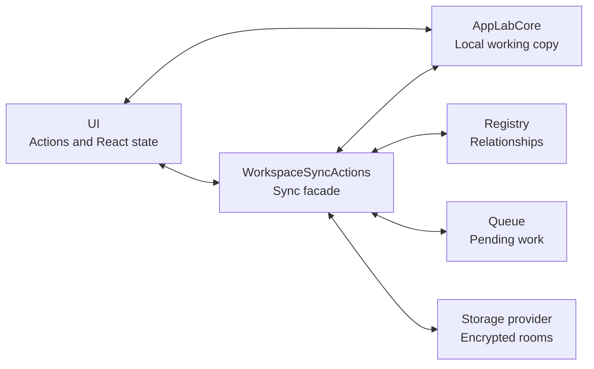

# Sync

Sync adds encrypted backup, sharing, and cross-device updates without replacing App Lab's local workspace.

## Summary

- **Public boundary:** `WorkspaceSyncActions` from `src/sync/index.ts`.
- **Owns:** sync relationships, encrypted rooms, durable outgoing work, invites, recovery, and conflict policy.
- **Local-first rule:** core remains usable and authoritative locally; only apps with a sync relationship create remote work.

## Why

Core can create, run, and edit apps offline, but one browser's IndexedDB cannot restore another device or exchange changes with a
friend. Sync mirrors selected local state into provider-neutral encrypted rooms and keeps enough local metadata to reconnect those
rooms later.

The provider is transport and storage, not a plaintext application backend.

## Model

`App.tsx` creates one core object and injects it into the sync facade before giving both contracts to UI:

```text
core = createIndexedDbCore()
syncActions = createBrowserWorkspaceSyncActions(core)
WorkspaceShell(core, syncActions)
```



| State owner | Location | Contents |
| --- | --- | --- |
| Core | IndexedDB `app-lab-v2` | App records and app-owned JSON. |
| Sync registry | `localStorage` key `app-lab-workspace-sync-v1` | Storage profile, workspace id, room capabilities, observed versions, and tombstones. |
| Sync queue | IndexedDB `app-lab-sync-queue-v1` | Pending room creation, app-source/data writes, deletion, and manifest writes. |
| Provider | Remote room records | Encrypted payload, version, timestamp, and access-token hashes. |

Each synced workspace has one `workspace-manifest` room. Each synced app has an `app-package` room for metadata, app source,
and compiled CSS, plus an `app-data` room for JSON. Separate app rooms let data update live without rebuilding the iframe.

## Main Flows

### App Source

**Local to remote:**

1. **`src/ui -> src/runtime`:** Compile Tailwind CSS from the edited app source.
2. **`src/ui -> src/core`:** Store the complete `AppRecord` locally.
3. **`src/ui -> src/sync`:** Queue the source write.
4. **`src/sync -> storage provider`:** Encrypt and save the source record in its `app-package` room.
5. **`src/sync`:** Remember the accepted room version and queue a workspace-manifest write.

**Remote to local:**

1. **Storage provider -> `src/sync`:** Report a newer `app-package` room snapshot.
2. **`src/sync`:** Check its version and pending-local barrier, then decrypt it.
3. **`src/sync -> src/core`:** Upsert the accepted `AppRecord`.
4. **`src/sync -> src/ui`:** Report the accepted source change.
5. **`src/ui -> src/runtime`:** Rebuild the active generated-app iframe.

App source, metadata, and compiled CSS are synchronized as one complete room payload. There is no line-level protocol or source
merge.

### App Data

**Local to remote:**

1. **Generated app -> `src/runtime`:** Call `AppLab.saveData(data)` through the bridge.
2. **`src/runtime -> src/ui`:** Validate the message and invoke the active app's save callback.
3. **`src/ui -> src/core`:** Save the JSON locally.
4. **`src/ui -> src/sync`:** Queue the data write.
5. **`src/sync -> storage provider`:** Encrypt and save the `app-data` room.

**Remote to local:**

1. **Storage provider -> `src/sync`:** Report a newer `app-data` room snapshot.
2. **`src/sync`:** Check its version and pending-local barrier, then decrypt it.
3. **`src/sync -> src/core`:** Save the accepted JSON.
4. **`src/sync -> src/ui`:** Report the accepted data change.
5. **`src/ui -> src/runtime`:** Notify the active app's `AppLab.onDataChange` handlers.

If the app has no data-change handler, core still saves the update and UI asks the user to reopen the app.

### Workspace Manifest

**Local to remote:**

1. **`src/sync`:** Record a relationship, room-version, or tombstone change in the sync registry.
2. **`src/sync`:** Queue a workspace-manifest write.
3. **`src/sync -> storage provider`:** Merge with the current remote manifest, encrypt, and save it.
4. **`src/sync`:** Remember the accepted manifest version and merged registry state.

**Remote to local:**

1. **Storage provider -> `src/sync`:** Report a newer workspace-manifest snapshot.
2. **`src/sync`:** Validate, decrypt, and merge relationships and tombstones.
3. **`src/sync -> src/core`:** Hydrate newly referenced apps and apply accepted deletions.
4. **`src/sync`:** Replace the local registry with the merged state.
5. **`src/sync -> src/ui`:** Report the change so UI refreshes the launcher.

The manifest describes sync relationships, not app content. Sync owns it; core does not create or merge it.

### Establish A Relationship

**Syncing your own workspace:**

1. **Owner -> `src/ui`:** Configure a storage provider.
2. **`src/ui -> src/sync`:** Set up the workspace:
    1. Save the storage profile.
    2. Create owned source/data room pairs for current apps.
    3. Read their latest state from core and upload it.
    4. Publish the workspace manifest.
3. **Owner -> `src/ui`:** Enter the workspace sync material in another browser.
4. **`src/ui -> src/sync`:** Restore the workspace:
    1. Decode the material and its embedded manifest snapshot.
    2. Merge that snapshot with the remote manifest.
    3. Hydrate core and the sync registry in the new browser.

Edits made before storage setup are not replayed as history; setup uploads the latest state currently held by core.

**Joining someone else's app:**

1. **Recipient -> `src/ui`:** Open the invite link.
2. **`src/ui -> src/sync`:** Preview the invite:
    1. Claim membership in the source room.
    2. Decrypt the app metadata for confirmation.
    3. Do not save the app locally.
3. **Recipient -> `src/ui`:** Confirm the import.
4. **`src/ui -> src/sync`:** Import the app:
    1. Claim membership in both app rooms.
    2. Decrypt and save the app source and data into core.
    3. Record a joined sync relationship using the sharer's storage provider.

## Rules

### Local And Lifecycle

- A fresh local-only save does not enqueue work or connect to a provider.
- Removing a storage profile retains existing relationships and queue records. Owned work waits; joined apps keep using the
  provider reference from their invite.
- Sync wakes at startup, browser/provider reconnection, window focus, and return to a visible tab.
- When sync is reachable, UI asks it to process pending work in dependency order:
    1. Create missing rooms.
    2. Save app source.
    3. Save app data.
    4. Apply owned-app deletions.
    5. Save the workspace manifest.
    6. Pull the latest workspace manifest.
- The configured workspace manifest stays subscribed. Individual source/data subscriptions exist only for the active app.

### Relationship Identity

- Sharing an owned app reuses its room ids; creating an invite does not create a second remote copy.
- A joined app remains attached to the owner's provider even if the recipient configures another provider.
- Forwarding a joined app passes on the same relationship. A remotely deleted joined app cannot be forwarded.
- A private copy has independent rooms owned by the recipient's workspace.

### Queue And Conflicts

- Queue items survive reloads and retry later. Repeated source/data writes coalesce to the latest relevant state; interrupted
  `syncing` items return to `pending` at startup.
- Pending local source or data work blocks an incoming snapshot that would discard it.
- On an ordinary source version conflict, sync reloads the current version and the pending local source wins.
- Pending app data can overwrite a newer remote snapshot after reconnecting.
- Manifest records merge by app id; highest room versions and deletion tombstones survive stale saves.
- An `app-package` deletion marker beats a conflicting pending source write. Once observed, sync discards that source write and
  queued app data.

### Deletion

- Local-only deletion removes the app record and data from core.
- Owned synced deletion writes a marker to the `app-package` room, deletes the data room, and records a manifest tombstone.
- Deleting a joined app locally does not alter the owner's rooms.
- Observing the owner's marker keeps a joined app's cached local copy, marks it **Deleted by owner**, and prevents forwarding.

### Recovery And Repair

- Workspace sync material merges its embedded point-in-time manifest with current remote state: newer remote records and
  tombstones survive, while embedded records not yet uploaded are retained.
- Missing owned app or manifest rooms can be recreated from local core/registry state without changing their identities.
- A recipient cannot recreate a missing joined room or silently turn it into an owned relationship.

### Security

- Generated apps receive only runtime's `window.AppLab` API; they never receive sync objects or capabilities.
- Each room payload uses browser-side AES-GCM with a separate 256-bit secret and authenticates its room id, type, and version.
- Provider rules enforce authenticated owner/member room access. Client token/version checks are correctness checks, not a
  read-only boundary against a modified authorized client.
- App invites grant full read/write access to one app's rooms. Workspace sync material restores the whole workspace and
  includes owner setup material. Treat both as sensitive bearer material.
- The MVP does not provide read-only invites, revocation, or key rotation.

See [Security](../SECURITY.md) for the complete trust model.

## Code Map

```text
src/sync/
├── index.ts                 Public contract and browser composition
├── workspaceSyncActions.ts  Workflow facade
├── workspace/               Registry, manifest, and recovery
├── rooms/                   Encryption and app-room operations
├── queue/                   Durable work and workers
├── providers/               Provider adapters and configuration
├── sharing/                 Invite encoding and parsing
└── testing/                 In-memory test support
```

## Verification

```bash
pnpm test
pnpm test:firebase-smoke
pnpm test:firebase-e2e
```

Unit tests cover provider-neutral policy. Firebase suites cover access rules, offline recovery, live updates, deletion, workspace
recovery, concurrent additions, and stale-browser tombstones through the real provider boundary.
